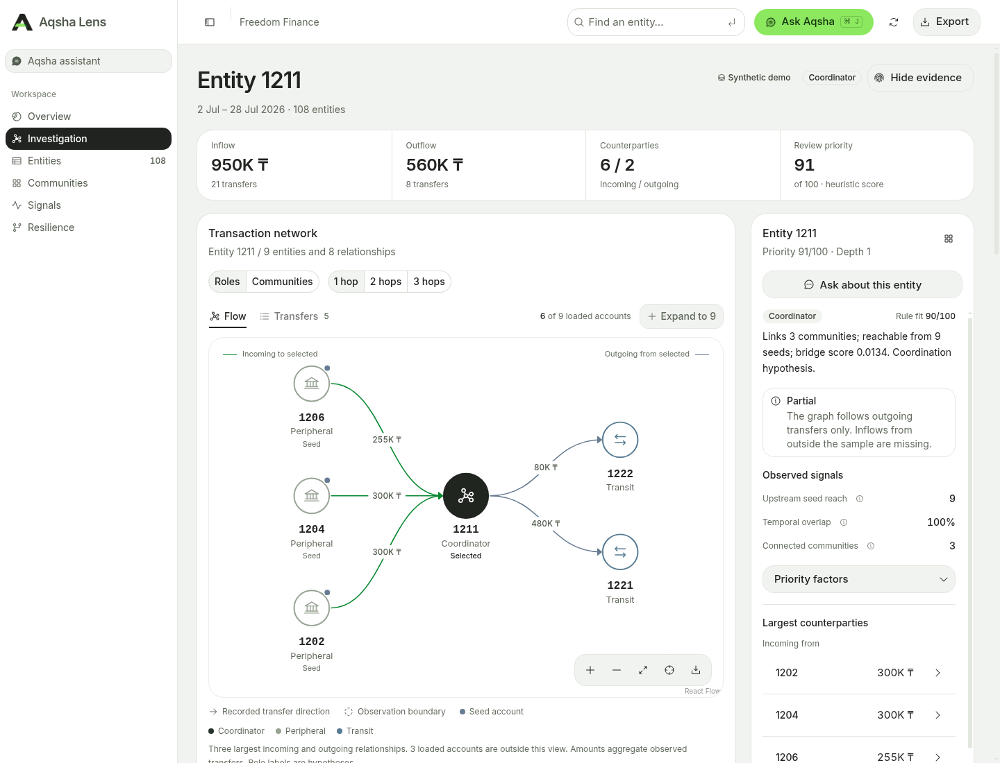
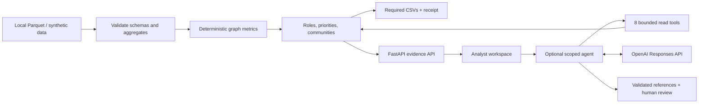

<p align="center">
  
</p>

# Aqsha Lens

**Explain the money graph. Show the evidence.**

An investigation workspace for the **Freedom Finance track at HackAlem AI**. Aqsha Lens turns the supplied transaction graph into explainable account roles, communities, a ranked review queue, and the three required CSVs. Analysts can inspect the numbers behind each result, follow directed transfers, and ask an optional AI assistant to explain the selected evidence.

The complete graph workflow runs locally with **no API key, GPU, database service, or subscription**. An original synthetic dataset makes the repository runnable without organizer files.

[Run locally](#run-locally) · [Required outputs](#required-outputs) · [Track coverage](#track-coverage) · [Architecture](#architecture) · [Verify](#verify-the-submission)



*Synthetic demo. Select an account, inspect the observed transfers, and open its evidence or assistant.*

> [!IMPORTANT]
> Roles are hypotheses about visible transaction structure. Scores measure heuristic role fit and review priority—not probability of crime. A depth-four account with no visible outflow is an **observation boundary**, not an established final beneficiary.

## Run locally

**Prerequisites:** Git, [uv](https://docs.astral.sh/uv/getting-started/installation/), and Node.js **22.12+** with npm. Use Bash on Linux/macOS or WSL on Windows. The first installation needs internet; uv installs Python 3.12 when needed.

```bash
git clone https://github.com/BAITC-Hacks/hack-5263c4cc-webspace.git
cd hack-5263c4cc-webspace
./scripts/dev.sh
```

Open **[http://127.0.0.1:8000](http://127.0.0.1:8000)**. The script installs locked dependencies, builds the interface, and starts the local service. With no data directory configured, expect **108 synthetic accounts, 114 directed relationships, and 447 transactions**, visibly labeled “Synthetic demo.”

After the initial build, restart with `uv run --frozen moneygraph serve`. For official data, retain `--data /absolute/path/to/data` or set `MONEYGRAPH_DATA_DIR` in `.env`. If port 8000 is occupied, use `PORT=8001 ./scripts/dev.sh` and open port 8001. API documentation is available at `/docs`.

### Use the official data

Extract the organizer's dataset locally. Point to the directory containing these files:

```text
data/
├── nodes.parquet         # gid, depth, is_seed
├── edges.parquet         # src, dst, sum_kzt, n_tx, depth
└── transactions.parquet  # src, dst, date, sum_kzt
```

```bash
MONEYGRAPH_DATA_DIR=/absolute/path/to/data ./scripts/dev.sh
```

The official dataset has **2,248 accounts, 3,119 directed relationships, 4,840 transactions, and 81 seeds**. Data is loaded at process startup; restart after changing it. Invalid schemas, duplicate IDs, missing endpoints, and inconsistent transaction aggregates fail explicitly instead of silently substituting demo data.

Organizer records, credentials, and generated exports are excluded from Git. The repository contains synthetic fixtures generated by the implementation, not redistributed bank records.

## Required outputs

From raw Parquet to all three required CSVs in one command:

```bash
uv run --frozen moneygraph export --data /absolute/path/to/data --out outputs/submission
```

For the synthetic demo, leave `MONEYGRAPH_DATA_DIR` unset and omit `--data`.

| File | Exact columns |
|---|---|
| `nodes_roles.csv` | `gid, role, role_score, cluster_id, priority_score, evidence` |
| `clusters.csv` | `cluster_id, n_nodes, n_seed, sum_kzt_internal, top_gids, hypothesis` |
| `top_nodes.csv` | `rank, gid, role, priority_score, why` |

Every input account receives a role and cluster, including isolated seeds. Exported scores are in **[0, 1]**; the interface displays them on a 100-point scale. `evidence` is nonempty numerical text, at most 200 characters. `top_gids` is encoded as a JSON array within its CSV field. The official dataset produces 100 ranked accounts, exceeding the required minimum of 20.

A separate `provenance.json` records canonical input, algorithm, and output hashes. It supplements the required files; it does not change their schemas or certify the conclusions.

**Measured official-data run, 23 September 2026:** **0.9401 seconds** for a fresh offline process to analyze and export the supplied data, with dependencies already installed. Host: Linux x86_64, Python 3.12.12, eight logical CPUs. Installation time is excluded; this is a local measurement, not a portability or million-node guarantee. [Measurement details](docs/validation.md).

| Verified official-data result | Value |
|---|---:|
| Accounts retained in role export | 2,248 / 2,248 |
| Communities / ranked accounts | 91 / 100 |
| Depth-four boundaries labeled `boundary_unknown` | 444 / 444 |
| Isolated seeds retained | 19 / 19 |
| Longest evidence string | 105 characters |

## Track coverage

The [official brief](https://docs.google.com/document/d/1JPLU-G6R25Ge2hVaY2J9cqvrx7FGExj87XKwJPaMz3o/edit) requires five core capabilities. Each has a direct inspection path:

| Required capability | Where to verify |
|---|---|
| Reproducible pipeline under five minutes | Export command and measured results above |
| Role, score, and explanation for every account | `nodes_roles.csv`; **Entities** search, including isolated seeds |
| Defensible role criteria and thresholds | Rules below; selected account's evidence and score decomposition |
| Network communities with statistics | **Communities** and `clusters.csv` |
| Ranked shortlist and interactive directed graph | **Overview**, **Investigation**, and `top_nodes.csv` |

All **eight optional categories** are implemented with explicit observation limits:

| Optional capability | Analyst action |
|---|---|
| Graph-cutoff handling | Inspect a depth-four account and its missing-outflow warning |
| Temporal patterns | Compare daily flows, spikes, and same-day multiple payers |
| Repeated routes and return flows | Inspect dated two-step routes and bounded cycle examples |
| Anomalies | Review depth-peer outliers and repeated-payment motifs |
| Network resilience | Compare connectivity after simulated removal of top-priority accounts |
| Natural-language assistant | Ask about a selected account or a cohort of up to five; inspect references and tool checks |
| Generated account card | Download an evidence dossier as Markdown |
| Completeness assessment | Read missing evidence and prioritized next requests |

[The complete criterion matrix](docs/criteria-matrix.md) links these features to implementation, tests, and search bounds. Additional work includes shared-collector path evidence, exact transfer tables, graph PNG export, and reproducibility receipts. Feature coverage does not establish detection accuracy.

The published rubric weights functionality **25%**, technical implementation **25%**, README/reproducibility **25%**, practical value **15%**, and development potential/originality **10%**. [Source audit](docs/research/readme-track-requirements.md).

## How roles and priorities work

The engine computes directed degrees, visible KZT sums, upstream seed reach, weighted PageRank, sampled directed betweenness, and daily flow overlap. Seeded, weighted Louvain clustering assigns every account to a community. Sorted inputs and deterministic tie-breaking make repeated exports reproducible.

| Role | Main eligibility rule |
|---|---|
| `consolidator` | At least 3 distinct incoming payers |
| `transit` | Non-seed with visible outflow; outflow/inflow ratio between 0.65 and 1.35 |
| `distributor` | At least 8 distinct outgoing recipients |
| `terminal` | Non-seed below the observation boundary, with inflow and no visible outflow |
| `coordinator` | Non-seed with at least 2 incoming and 2 outgoing counterparties, 2 neighboring communities, 2 upstream seeds, and positive betweenness at or above its 90th percentile |
| `peripheral` | No stronger eligible rule; includes isolated accounts |
| `boundary_unknown` | Depth ≥ 4 and no visible outflow; documented extension allowed by the brief |

Eligible roles receive explicit rule-fit scores; the strongest wins with a fixed tie order. Priority combines **20% PageRank + 20% betweenness + 20% seed reach + 15% incoming counterparties + 15% visible volume + 10% temporal overlap** after normalization. Boundary priority is multiplied by 0.65; isolates receive zero. [Exact formulas, normalization, and caveats](docs/methodology.md).

Optional signal searches and AI answers do **not** modify roles, rankings, or submitted CSVs. No model is trained on invented ground-truth labels.

## Architecture



| Layer | Shipped components | Code |
|---|---|---|
| Data and analysis | Polars, NetworkX, explicit rules | [`engine.py`](src/moneygraph/engine.py), [`signals.py`](src/moneygraph/signals.py) |
| Service and exports | FastAPI, Pydantic, provenance receipts | [`api.py`](src/moneygraph/api.py), [`audit.py`](src/moneygraph/audit.py) |
| Agent | OpenAI SDK, bounded runtime, scoped memory | [`agent/`](src/moneygraph/agent/), [`copilot.py`](src/moneygraph/copilot.py) |
| Interface | React, Base UI/shadcn, assistant-ui, Phosphor, React Flow/Dagre, Recharts | [`web/src/`](web/src/) |

One Python service serves the compiled web app. Dependency versions are locked in [`uv.lock`](uv.lock) and [`web/package-lock.json`](web/package-lock.json). [Architecture decisions](docs/architecture.md) explain why a graph database, vector store, GPU, and orchestration framework are unnecessary for this dataset. LangGraph, Chroma, and Mem0 are researched options, not claimed installed features.

### Optional AI assistant

The assistant is available from the header, sidebar, or **Ctrl/⌘ J**. It supports conversations, editing, retry, version navigation, copy, export, and stop-waiting controls. Each conversation keeps its selected account/cohort; opening a different graph node does not silently retarget it.

To enable provider-backed answers, copy `.env.example` to `.env` and configure these server-side values, then restart:

```dotenv
OPENAI_API_KEY=your_key_here
OPENAI_MODEL=gpt-6-sol
MONEYGRAPH_AI_ENABLED=true
MONEYGRAPH_ALLOW_EXTERNAL_AI=true
```

Enable external processing only for data you are permitted to send. Without these settings—or if the provider fails—the app returns a labeled local evidence summary. It does not pretend that this fixed summary answers arbitrary questions.

The model can request **eight allowlisted read tools** within fixed account scope. It cannot execute arbitrary SQL, shell commands, URLs, or files. Each answer has a limit of **3 model rounds and 4 tool calls**, with two concurrent runs, output/context budgets, and bounded request timeouts. References must come from evidence retrieved in the current run; a valid reference still requires a human to check the interpretation.

Follow-ups use at most **6 messages / 12,000 characters**, bound to the dataset, code version, and selected accounts. Context defaults to process memory and expires after 24 hours. `MONEYGRAPH_MEMORY_PATH` optionally enables private SQLite storage; browser conversations still disappear on refresh. Editing/retrying an incompatible branch resets server context. Session tokens are excluded from transcript exports. See [memory, privacy, and execution limits](docs/architecture.md#scoped-conversation-memory).

> [!NOTE]
> Keep private data and paid API access on loopback. Local request limits and browser-origin checks are implemented; multi-user authentication and tenant isolation are not. OpenAI requests use `store=False`, which is not a Zero Data Retention guarantee.

## Verify the submission

```bash
./scripts/check.sh
uv run --frozen python scripts/evaluate_copilot.py
```

The first command installs frozen dependencies, runs backend and session tests, and builds the production frontend. Session tests check conversation isolation, branching, cancellation, deletion races, and token-free exports. The evaluation script runs seven synthetic scenarios offline; `--live` explicitly opts into a paid provider check using synthetic evidence only.

**Current local checks:** 130 backend tests, 8 session tests, and the TypeScript/Vite production build passed. Tests cover exact CSV contracts, input-order invariance, isolated seeds, observation boundaries, temporal ordering, search bounds, tool authorization, memory expiry, and request safeguards. The startup command also passed from a clean checkout of the final application commit. [Clean-checkout verification](docs/readme-verification.md) · [Full validation and its limits](docs/validation.md).

**Five-minute walkthrough:**

1. Run the official-data export live; inspect the three CSV headers and full account coverage.
2. Explain three reviewer-selected account IDs within one minute using visible counterparties, amounts, score factors, and [exact rules](docs/methodology.md). Walk through two or three in depth during the overall demo.
3. Include a depth-four boundary and an isolated seed; explain what the dataset cannot establish.
4. Follow a route or shared collector, inspect a dated signal, and compare a removal scenario.
5. Ask the assistant a narrow question and inspect its references; show that exports and investigation remain available with AI disabled.

For frontend development, run `uv run --frozen moneygraph serve` and `npm --prefix web run dev` in separate terminals. The Vite proxy forwards `/api` to the local backend.

## Limits and next steps

The official data is a **July 2026 outgoing intra-bank crawl**, limited to four hops and transfers of at least **5,000 KZT**. Outside inflows, other banks, smaller transfers, and later activity are missing. Visible sums are not balances; daily overlap cannot prove intraday order or trace the same funds. Communities do not prove affiliation. There are no ground-truth role labels, so precision, recall, AUC, and probabilities of wrongdoing are not reported.

At approximately **one million accounts**, move aggregation to partitioned Parquet, precompute versioned features and rankings, sample expensive centrality, and serve indexed bounded neighborhoods. Benchmark graph backends before selecting CPU/GPU infrastructure. Then evaluate usefulness against amount-only and degree-only baselines with domain reviewers. These are documented next steps, not measured capabilities. [Scaling decision](docs/architecture.md#adr-2-polars--networkx-at-this-scale).

## Documentation and sources

- [Official track brief](https://docs.google.com/document/d/1JPLU-G6R25Ge2hVaY2J9cqvrx7FGExj87XKwJPaMz3o/edit) · [Hackathon rules](https://edu.astanahub.com/hackathons/df4743f5-c492-415c-b45a-1f13adb78e06?tab=tracks)
- [Criterion coverage](docs/criteria-matrix.md) · [Methodology](docs/methodology.md) · [Architecture](docs/architecture.md)
- [Acceptance and evaluation plan](docs/acceptance.md) · [Measured validation](docs/validation.md)
- [Track requirements and judging source audit](docs/research/readme-track-requirements.md) · [README research and reference review](docs/research/readme-practices-sources.md)
- [Agent architecture research](docs/research/architecture-agent-hardening-2026.md) · [Framework and project comparison](docs/research/ecosystem-2026.md)
- [Third-party components and attribution](THIRD_PARTY.md) · [Engineering invariants](AGENTS.md)

The task-specific analysis, observation-boundary treatment, and export contracts were built for this case. Reused libraries and components are disclosed; organizer archives and third-party applications are not presented as an original finished solution.
