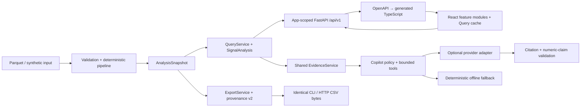

# Architecture and decisions

Decision date: 23 September 2026. Integrated upstream: `c2eb471` (including the Aqsha Lens redesign and agent/security hardening). Scope: Freedom Finance Money Graph. This is a local investigation prototype, not a production AML decision system. The [approved design](superpowers/specs/2026-09-23-moneygraph-architecture-design.md) and [implementation plan](superpowers/plans/2026-09-23-architecture-refactor.md) describe this refactor; [verification](architecture-verification.md) distinguishes current checks from historical dataset benchmarks.

## Acceptance contract

Load all three supplied Parquet tables and retain every node, including isolated seeds. Compute explainable financial roles, structural communities, a ranked investigation queue, and daily flow evidence. Export the exact required CSV schemas for every node, every cluster, and at least twenty priority accounts. Provide a directed graph, search by account ID, and a usable clean-machine launch without personal subscriptions. The graph pipeline must finish within five minutes on the supplied dataset; report measured performance separately from projections.

No learned accuracy is claimed because the supplied data has no labels. No automated blocking, suspicion filing, customer identification, external enrichment, full-bank coverage, or ownership inference is implemented.

## Runtime shape

The application has one Python service and a compiled browser bundle. `bootstrap.build_context` constructs one `ApplicationContext` per FastAPI lifespan. It owns a completed snapshot, query/export services, one shared signal cache, an evidence service, bounded conversation storage and the copilot's concurrency/cooldown gates. Separate app instances cannot borrow another instance's dataset through a global fallback. Creating an app or exporting OpenAPI performs no dataset/provider I/O. Restart after changing the input directory; live ingestion is outside this prototype.

The design is a modular monolith with explicit I/O adapters. It has no mandatory database, queue, vector index, managed cloud service, GPU or model download. This preserves the local acceptance contract while giving ingestion, analysis, evidence serving and optional model access independent interfaces.

| Boundary | Ownership | Dependencies |
|---|---|---|
| `domain/` | CSV constants, rule configuration, role and priority rules | Python values |
| `analysis/` | Validation, graph algorithms, temporal features, pipeline, snapshot, optional signals | Domain, Polars, NetworkX; no runtime environment/provider/filesystem reads |
| `application/` | Queries, exact export serialization, provenance hashing, shared evidence and app context | Completed analysis and service interfaces |
| `adapters/` | Parquet reads, artifact writes, calculation-source manifest reads, provider I/O | Filesystem or configured SDK |
| `copilot/` | Read-tool allowlist, fixed account scope, budgets, answer checks and fallback | Evidence service and provider adapter |
| `api/` | HTTP validation, response schemas, legacy adapter, security headers | App-owned services |
| `web/src/features/` | Investigation queue, graph, evidence, communities, signals, resilience and copilot | Generated wire types and shared query client |

`engine.py`, `signals.py`, `audit.py` and package entry points retain existing imports as compatibility facades. New callers use public snapshot reads. Nested dictionaries, rows and graph attributes returned to a consumer are detached copies. Signal-cache population is serialized and cached results are copied, so one view cannot modify another view or a later export.

HTTP views and copilot capabilities use the same `EvidenceService`. Each tool envelope includes the analysis identity and a content fingerprint alongside its evidence ID. The envelope records the exact bounded evidence seen by that tool; it does not grant the model any additional query authority. Input validation rejects unsupported ID ranges and non-integer ID/count/depth values before analysis, keeping the loader and API contracts consistent.

## ADR 1: deterministic analysis before language generation

Roles and rankings come from explicit numerical rules, graph structure, and observed dates. The model cannot write roles, scores, clusters, or submitted exports. A deterministic core makes numerical behavior inspectable and the demo resilient to provider latency, quota failures, and missing credentials. It also permits reproducibility tests that a free-form multi-agent committee would not satisfy.

A GNN is rejected for this build: no role labels or appropriate held-out ground truth are supplied. Training on synthetic laundering labels would create an unverified domain transfer and would not establish real-world detection performance. Unsupervised representations remain a future experiment against a transparent baseline, not a justification for a claim of guilt.

## ADR 2: Polars + NetworkX at this scale

Polars handles typed Parquet input and column aggregation. NetworkX provides accessible directed graph algorithms and explicit node preservation. At 2,248 nodes and 3,119 observed pairs, the operational cost of a separate graph database is unjustified. DuckDB is a credible alternative for larger analytical scans; adding both Polars and DuckDB here would duplicate the data layer.

NetworkX is not a promised million-node production architecture. At that scale: validate and aggregate in partitioned Parquet; materialize stable node/edge features; compute communities and centrality as offline versioned jobs; serve bounded subgraphs and precomputed ranks. Benchmark igraph, graph-tool, or cuGraph against the same feature contracts. Approximate expensive centrality with measured error. Use a database only when persistent incremental queries, multi-user cases, or transactional state require one. Graph GPU acceleration requires supported algorithms, graph conversion and memory checks; it is not automatic performance portability. [NetworkX backends](https://networkx.org/documentation/stable/reference/backends.html), [nx-cugraph](https://github.com/rapidsai/nx-cugraph).

## ADR 3: preserve the upstream React Flow/Dagre investigation map

The upstream redesign replaced Cytoscape with React Flow and Dagre. This refactor preserves that implementation and the Aqsha Lens visual system. Its default map shows the three largest incoming and outgoing relationships; expansion shows up to 25 accounts. The UI distinguishes this visual limit from the independently bounded server neighborhood and includes exact amounts in a keyboard-accessible transfers table. PNG export, account selection and mobile evidence sheets remain available. See [the design system](../DESIGN.md) and [upstream design research](research/redesign-reference-study.md).

The API discloses node and edge truncation independently. A readable neighborhood is the current product requirement; a whole-bank renderer or another graph database is a separate measured scaling decision.

## ADR 4: a bounded agent with eight read tools

The copilot is a single Responses API loop. Its tools are `inspect_selected_node`, `inspect_neighborhood`, `inspect_cluster`, `inspect_patterns`, `find_common_collectors`, `simulate_top_removal`, `inspect_missing_evidence`, and `inspect_investigation_brief`. Tool arguments are empty objects; account scope is fixed in application code. The analyst may explicitly select a cohort of up to five existing accounts; the model cannot substitute cohort IDs. The resilience tool uses a fixed top-five simulation and cannot mutate the graph. The model cannot select another tenant, request an arbitrary URL, construct SQL, execute Python or shell, modify files, or change graph scores. User questions remain user input, never interpolated into privileged instructions.

Each request permits at most three model rounds and four tool calls, at most 2,000 output tokens per round, a 20-second timeout per API request and no SDK retries. A 45-second investigation deadline is checked around provider calls and tools; each SDK timeout is reduced to the remaining budget and a late response is rejected. Local bounded computations are not forcibly interrupted mid-function. Only two copilot investigations run concurrently per app context. The final round exposes no tools. Neighborhood evidence is bounded to 35 nodes and 60 edges. Each tool response must fit 24,000 characters. Total context, including provider replay items, is capped at 80,000 characters and output at 6,000 tokens across the run. Duplicate call IDs are rejected; repeated validated reads use a request-local cache. Provider rate limits activate a 30-second app-owned cooldown. Pattern context is further limited to four recurring routes and four cycles, with three example occurrences per route; collector context contains at most eight candidates. The UI receives an observable tool trace, not private chain-of-thought.

The final answer has a strict JSON schema and locally validated size bounds. Citation IDs must have been returned by a tool during that request. Structured numeric claims identify an evidence ID, field path and exact numeric value; the validator compares these with retrieved data and rejects mismatches. This does **not** prove that all prose claims are covered or every sentence follows from its source. Human review and adversarial evaluation remain necessary. Provider errors and failed validation return a clearly labeled local summary without logging raw request/exception content. Cleanup errors cannot replace the safe response or leak a concurrency slot. [Function calling](https://developers.openai.com/api/docs/guides/function-calling), [Structured outputs](https://developers.openai.com/api/docs/guides/structured-outputs), [Agent safety](https://developers.openai.com/api/docs/guides/agent-builder-safety).

OpenAI Agents SDK adds standard orchestration, tracing and handoffs; LangGraph adds durable execution and explicit state; PydanticAI emphasizes typed agent interfaces. None is required to implement eight bounded read tools. Add a framework when a real requirement appears: resumable long-running cases, approval pauses, shared sessions, distributed task execution, or agent/provider interchange. Do not confuse the most capable framework with the best architecture for this workload. The dated ecosystem research compares these options and verified repository activity.

## ADR 5: model and privacy boundary

The default optional model is `gpt-6-sol` with low reasoning effort. Current official documentation describes function calling and structured output support; the provided project credential was checked against the live model list. GPT-6 Astra remains a quality benchmark candidate, not the default: official standard prices were $10/$50 per million input/output tokens versus Sol's $2/$10 at research time. No claim is made that Sol is superior on financial reasoning; compare both on the proposed evidence evaluation before changing defaults. [Sol](https://developers.openai.com/api/docs/models/gpt-6-sol), [Astra](https://developers.openai.com/api/docs/models/gpt-6-astra).

`MONEYGRAPH_AI_ENABLED` and `MONEYGRAPH_ALLOW_EXTERNAL_AI` must both be true and a server-side API key must be present. Defaults are false. Only bounded account evidence is sent after that opt-in. Responses use `store=False`. This disables response application-state storage; it does not establish Zero Data Retention or eliminate provider abuse monitoring. Organizer authorization, provider policy and account controls still determine whether real data can be sent. The offline path needs no key and remains fully functional. [OpenAI data controls](https://developers.openai.com/api/docs/guides/your-data).

Brev is an optional infrastructure management integration. Its `bak-` token is not an NVIDIA NIM inference API key. This workload does not require a GPU, so cloud compute is not provisioned merely because a credential exists.

## Agent engineering evaluation

Unit tests verify fixed tool scope, unknown-tool rejection, finite loop budget, missing-account handling, citation checks, no response storage, bounded questions and the offline path. Fake clients exercise failure conditions without consuming provider credits. `scripts/evaluate_copilot.py` runs seven original synthetic scenarios in offline mode by default and accepts `--live` for a provider check. Scenarios cover factual evidence, depth boundaries, isolated seeds, attempted secret/shell access, five-account collectors, temporal patterns and removal simulation. The checks validate observable contracts and selected caveats; they do not establish semantic entailment, financial accuracy or comprehensive prompt-injection resistance.

Before widening agent autonomy, maintain a versioned evaluation set: (1) exact numerical questions, (2) boundary-account questions, (3) daily-versus-intraday ambiguity, (4) prompt injection requesting shell/URLs/secrets, (5) nonexistent accounts/citations, (6) network/quota failures, and (7) an unsupported accusation. Measure factual-number agreement, source validity, boundary caveat recall, abstention, latency, token usage, and fallback rate. Never score verbosity or confidence as correctness. Do not train against the small demo set and report it as a held-out benchmark.

## Deployment boundary

The local service binds to loopback by default. It intentionally has no authentication or multi-tenant authorization. Do not expose this prototype to the public internet with private data or an enabled paid API key. A real deployment needs identity, per-case access control, distributed request quotas, secure transport, audit retention, secret management, data deletion, and tenant-isolation tests. These are deployment requirements, not hidden features claimed by this scaffold.

## ADR 6: optional signals and reproducibility receipts

All eight optional brief categories are implemented as inspectable analytical features: observation boundaries, daily temporal patterns, recurring routes/return cycles, depth-peer and repeated-amount signals, node-removal sensitivity, natural-language graph assistance, generated dossiers, and prioritized requests for missing evidence. The criterion matrix records concrete coverage and verification. These features run separately from role assignment, so exploratory calculations cannot silently alter required exports.

`ExportService.render(name)` is the sole CSV serializer. CLI files, HTTP downloads and receipt hashes consume its UTF-8/CRLF bytes. Column order, row ordering and numbers remain identical to the baseline; the synthetic fixture's three CSV hashes are regression-tested.

Receipt schema v2 hashes canonical input records, an explicit manifest of calculation modules normalized to UTF-8/LF, the rule configuration, `uv.lock` and each exact CSV artifact. The manifest is captured at analysis construction, so later file edits cannot silently change a running result's identity. `analysis_id` binds the dataset and calculation configuration; it deliberately excludes runtime duration, timestamps and local absolute paths. A new source version may have a new identity even when its CSVs are identical. The manifest covers the calculation and serialization implementation, not every UI/provider file or authenticity of bank data. A portable Markdown dossier carries observations, hypotheses, missing evidence and the dataset/algorithm receipt.

## ADR 7: one typed HTTP contract

Pydantic response schemas define `/api/v1`. `scripts/export_openapi.py` exports `web/openapi.json`; `web/scripts/generate-api.mjs` generates the TypeScript contract. CI checks both artifacts for drift. Nullable values such as an absent pass-through ratio or empty observation period remain nullable in the browser. [FastAPI response models](https://fastapi.tiangolo.com/tutorial/response-model/), [openapi-typescript](https://openapi-ts.dev/introduction).

Every account identifier in v1 is an exact decimal string, including IDs nested in paths, payer arrays, graph edges and citations. Request IDs are validated against nonnegative int64 bounds. Python calculations and CSV identifiers remain integers; legacy `/api` responses retain the prior numeric representation. Error envelopes use stable codes and request correlation IDs without echoing submitted question text or provider errors.

Interactive graphs have independent caps of 400 nodes and 2,000 edges. `total_nodes`, `total_edges`, `returned_nodes`, `returned_edges` and `truncation_reasons` disclose what was omitted. Totals refer to the eligible neighborhood before display caps. Empty bounded results do not establish that no pattern exists outside the view.

## ADR 8: frontend modules and server state

Each feature owns its interaction and rendering; the app composes the workspace. A shared TanStack Query client owns remote state. Query keys contain the analysis identity, selected IDs, filters and pagination. Fetch functions propagate cancellation. Dataset identity changes invalidate prior evidence and selection, and a new account does not temporarily inherit an old account's response. AI requests are explicit user actions without automatic retries. [TanStack Query](https://tanstack.com/query/latest/docs/framework/react/overview).

The refactor keeps the updated React Flow/Dagre, Base UI, assistant-ui, Recharts and Aqsha Lens styling. Feature modules own overview, queue pagination, evidence, communities, graph controls, signals, cohort exploration and resilience. The graph, charts, inspector and assistant load as separate chunks. Phosphor icons use their published per-icon entry points to avoid loading the entire icon catalog during compilation.

The shipped assistant view keeps the upstream independent-question behavior: prior answers stay in that view, and each question retrieves current scoped evidence. The optional session API and reusable `AssistantSessions` helper support retained context for clients that explicitly opt in; this refactor does not silently enable transcript persistence in the browser.

## Patterns adopted from other projects

| Reference | Useful architectural pattern | Application here |
|---|---|---|
| [ThreatSight 360](https://github.com/mongodb-industry-solutions/fsi-aml-fraud-detection/blob/main/docs/SOLUTION_ARCHITECTURE.md) | Separate analytical evidence, narrative and human review stages | Deterministic snapshot → bounded evidence tools → checked narrative; cloud components are not required |
| [GraphSense](https://graphsense.org/documentation.html) | Separate analytical data preparation from query APIs and investigation UI | Pipeline, query services and browser features have distinct contracts |
| [RedThread](https://github.com/FalkorDB/RedThread#architecture) | Separate graph evidence and persistent investigation cases | Preserve a seam for future case storage; current read-only prototype needs no case database |

These are architectural adaptations, not claims that their full deployment stacks fit the hackathon. A case database becomes useful when notes, decisions and saved investigations become product requirements; the optional conversation store below is not a case-management system. Durable LangGraph execution becomes useful when investigations must pause, resume or survive process restarts. Distributed graph infrastructure needs measurements on a larger target dataset. Each addition should solve a demonstrated requirement while retaining the evidence/export contract.

## ADR 9: integrate local safeguards and optional conversation memory

The upstream ASGI guard remains active for both `/api` and `/api/v1`: trusted hosts, explicit development origins, foreign-origin mutation rejection, bounded actual body bytes (96 KiB), a 10-second body deadline, JSON-only mutation bodies, framing/compression validation and app-local token buckets. Defaults are 240 API requests/minute per peer and 1,200 globally; copilot POST requests share 12/minute per peer and 30 globally across both API versions. Client identity comes from the transport peer; the CLI disables proxy header rewriting. Rejections preserve CORS, `Retry-After`, safe error envelopes and request IDs. CSP and other browser headers are retained. These are local resource controls, not identity or multi-user authorization.

`POST /api/v1/copilot/sessions` creates an empty scoped session; `remember=true` with its capability opts a request into context reuse. `DELETE /api/v1/copilot/sessions/{session_id}` forgets it. Limits are 128 sessions, 24-hour TTL, six turns and 12,000 history characters. Random capability tokens are hashed in storage and excluded from public reply metadata. Dataset/calculation identity, selected account and canonical cohort bind each session. Leases prevent concurrent appends, while revision checks prevent a deleted or superseded turn from being restored by a late response. History is untrusted context; citation evidence must be retrieved again in every run.

Storage belongs to the app lifespan and closes at shutdown. Default storage is process-local SQLite in memory. `MONEYGRAPH_MEMORY_PATH` explicitly opts into a local file; keep the file and sidecars in an ignored private directory. POSIX files use mode 0600; Windows inherits directory ACLs and is not described as providing POSIX permissions. Symlink/reparse-point database targets are rejected. No transcript or capability is logged. Persistent storage is not encrypted by this prototype. See the [upstream hardening research](research/architecture-agent-hardening-2026.md) for deployment boundaries and deferred durable workflows.
