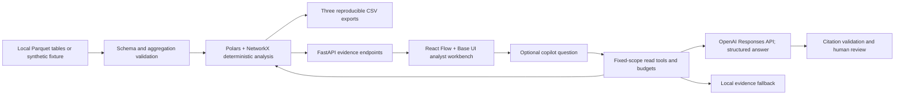

# Architecture and decisions

Decision date: 23 September 2026. Scope: Freedom Finance Money Graph. This is a local investigation prototype, not a production AML decision system.

## Acceptance contract

Load all three supplied Parquet tables and retain every node, including isolated seeds. Compute explainable financial roles, structural communities, a ranked investigation queue, and daily flow evidence. Export the exact required CSV schemas for every node, every cluster, and at least twenty priority accounts. Provide a directed graph, search by account ID, and a usable clean-machine launch without personal subscriptions. The graph pipeline must finish within five minutes on the supplied dataset; report measured performance separately from projections.

No learned accuracy is claimed because the supplied data has no labels. No automated blocking, suspicion filing, customer identification, external enrichment, full-bank coverage, or ownership inference is implemented.

## Runtime shape

The application has one Python service and a compiled browser bundle. It has no mandatory database, queue, vector index, managed cloud service, GPU, or model download. The analysis object is computed once per process and read by HTTP handlers. Restart after changing the input directory; live ingestion is outside this prototype.

## ADR 1: deterministic analysis before language generation

Roles and rankings come from explicit numerical rules, graph structure, and observed dates. The model cannot write roles, scores, clusters, or submitted exports. A deterministic core makes numerical behavior inspectable and the demo resilient to provider latency, quota failures, and missing credentials. It also permits reproducibility tests that a free-form multi-agent committee would not satisfy.

A GNN is rejected for this build: no role labels or appropriate held-out ground truth are supplied. Training on synthetic laundering labels would create an unverified domain transfer and would not establish real-world detection performance. Unsupervised representations remain a future experiment against a transparent baseline, not a justification for a claim of guilt.

## ADR 2: Polars + NetworkX at this scale

Polars handles typed Parquet input and column aggregation. NetworkX provides accessible directed graph algorithms and explicit node preservation. At 2,248 nodes and 3,119 observed pairs, the operational cost of a separate graph database is unjustified. DuckDB is a credible alternative for larger analytical scans; adding both Polars and DuckDB here would duplicate the data layer.

NetworkX is not a promised million-node production architecture. At that scale: validate and aggregate in partitioned Parquet; materialize stable node/edge features; compute communities and centrality as offline versioned jobs; serve bounded subgraphs and precomputed ranks. Benchmark igraph, graph-tool, or cuGraph against the same feature contracts. Approximate expensive centrality with measured error. Use a database only when persistent incremental queries, multi-user cases, or transactional state require one. Graph GPU acceleration requires supported algorithms, graph conversion and memory checks; it is not automatic performance portability. [NetworkX backends](https://networkx.org/documentation/stable/reference/backends.html), [nx-cugraph](https://github.com/rapidsai/nx-cugraph).

## ADR 3: readable directed account network

React Flow 12.11.6 and Dagre 3.1.1 render a directed left-to-right account flow map. DOM-based circular account glyphs and labels support readable labels, keyboard selection and the existing Base UI components. The default view contains the selected entity and its three largest incoming and outgoing relationships; expansion is bounded to 25 loaded accounts and discloses omitted counts. The API's separate 180-account neighborhood cap remains visible. Minimum zoom preserves readable type rather than shrinking an entire network to fit. On mobile the exact transfer table is the default, with a pannable flow view available.

Edges retain their recorded direction, including cycles and self-transfers. No flow conservation or identity of funds is inferred from a path. PNG export captures the current viewport. The dated [visual investigation research](research/visual-investigation-ux-2026.md) compares React Flow, G6, Sigma, Reagraph, Cytoscape, ECharts and Nivo. GPU throughput and 3D rendering do not by themselves improve the investigator's ability to read a transfer. Supporting charts use the existing Recharts/shadcn Chart system rather than adding another general chart runtime.

## ADR 4: a bounded agent with seven read tools

The copilot is a single Responses API loop. Its tools are `inspect_selected_node`, `inspect_neighborhood`, `inspect_cluster`, `inspect_patterns`, `find_common_collectors`, `simulate_top_removal`, and `inspect_missing_evidence`. Tool arguments are empty objects; account scope is fixed in application code. The analyst may explicitly select a cohort of up to five existing accounts; the model cannot substitute cohort IDs. The resilience tool uses a fixed top-five simulation and cannot mutate the graph. The model cannot select another tenant, request an arbitrary URL, construct SQL, execute Python or shell, modify files, or change graph scores. User questions remain user input, never interpolated into privileged instructions.

Each request permits at most three model rounds and four tool calls, at most 2,000 output tokens per round, a 20-second timeout per API request and no SDK retries. Only two copilot requests run concurrently in this process. The final round exposes no tools. Neighborhood evidence is bounded to 35 nodes and 60 edges. Each tool response must fit 24,000 characters. Pattern context is further limited to four recurring routes and four cycles, with three example occurrences per route; collector context contains at most eight candidates. The UI receives an observable tool trace, not private chain-of-thought.

The final answer has a strict JSON schema and locally validated size bounds. Citation IDs must have been returned by a tool during that request. This prevents invented source identifiers; it does **not** prove every sentence follows from the source. Human review, adversarial evaluation and numerical consistency checks remain necessary. Provider errors and failed validation return a clearly labeled local summary without logging raw request/exception content. [Function calling](https://developers.openai.com/api/docs/guides/function-calling), [Structured outputs](https://developers.openai.com/api/docs/guides/structured-outputs), [Agent safety](https://developers.openai.com/api/docs/guides/agent-builder-safety).

OpenAI Agents SDK adds standard orchestration, tracing and handoffs; LangGraph adds durable execution and explicit state; PydanticAI emphasizes typed agent interfaces. None is required to implement seven bounded read tools. Add a framework when a real requirement appears: resumable long-running cases, approval pauses, shared sessions, distributed task execution, or agent/provider interchange. Do not confuse the most capable framework with the best architecture for this workload. The dated ecosystem research compares these options and verified repository activity.

## ADR 5: model and privacy boundary

The default optional model is `gpt-6-sol` with low reasoning effort. Current official documentation describes function calling and structured output support; the provided project credential was checked against the live model list. GPT-6 Astra remains a quality benchmark candidate, not the default: official standard prices were $10/$50 per million input/output tokens versus Sol's $2/$10 at research time. No claim is made that Sol is superior on financial reasoning; compare both on the proposed evidence evaluation before changing defaults. [Sol](https://developers.openai.com/api/docs/models/gpt-6-sol), [Astra](https://developers.openai.com/api/docs/models/gpt-6-astra).

`MONEYGRAPH_AI_ENABLED` and `MONEYGRAPH_ALLOW_EXTERNAL_AI` must both be true and a server-side API key must be present. Defaults are false. Only bounded account evidence is sent after that opt-in. Responses use `store=False`. This disables response application-state storage; it does not establish Zero Data Retention or eliminate provider abuse monitoring. Organizer authorization, provider policy and account controls still determine whether real data can be sent. The offline path needs no key and remains fully functional. [OpenAI data controls](https://developers.openai.com/api/docs/guides/your-data).

Brev is an optional infrastructure management integration. Its `bak-` token is not an NVIDIA NIM inference API key. This workload does not require a GPU, so cloud compute is not provisioned merely because a credential exists.

## Agent engineering evaluation

Unit tests verify fixed tool scope, unknown-tool rejection, finite loop budget, missing-account handling, citation checks, no response storage, bounded questions and the offline path. Fake clients exercise failure conditions without consuming provider credits. `scripts/evaluate_copilot.py` runs seven original synthetic scenarios in offline mode by default and accepts `--live` for a provider check. Scenarios cover factual evidence, depth boundaries, isolated seeds, attempted secret/shell access, five-account collectors, temporal patterns and removal simulation. The checks validate observable contracts and selected caveats; they do not establish semantic entailment, financial accuracy or comprehensive prompt-injection resistance.

Before widening agent autonomy, maintain a versioned evaluation set: (1) exact numerical questions, (2) boundary-account questions, (3) daily-versus-intraday ambiguity, (4) prompt injection requesting shell/URLs/secrets, (5) nonexistent accounts/citations, (6) network/quota failures, and (7) an unsupported accusation. Measure factual-number agreement, source validity, boundary caveat recall, abstention, latency, token usage, and fallback rate. Never score verbosity or confidence as correctness. Do not train against the small demo set and report it as a held-out benchmark.

## Deployment boundary

The local service binds to loopback by default. It intentionally has no authentication or multi-tenant authorization. Do not expose this prototype to the public internet with private data or an enabled paid API key. A real deployment needs identity, per-case access control, request budgets/rate limiting, secure transport, audit retention, secret management, data deletion, and tenant-isolation tests. These are deployment requirements, not hidden features claimed by this scaffold.

## ADR 6: optional signals and reproducibility receipts

All eight optional brief categories are implemented as inspectable analytical features: observation boundaries, daily temporal patterns, recurring routes/return cycles, depth-peer and repeated-amount signals, node-removal sensitivity, natural-language graph assistance, generated dossiers, and prioritized requests for missing evidence. The criterion matrix records concrete coverage and verification. These features run separately from role assignment, so exploratory calculations cannot silently alter required exports.

The additional evidence receipt hashes canonical input records, the exact CSV bytes and the analysis source. Input-order invariance and output hashes are tested. A portable Markdown dossier carries observations, hypotheses, missing evidence and the dataset/algorithm receipt. This helps reviewers reproduce a case, but a hash alone does not authenticate the bank data or validate a hypothesis.

## ADR 7: complete Base UI dashboard and evidence-specific interaction

The application uses the official shadcn Base Nova dashboard foundation: its sidebar/inset layout, branded semantic tokens, Geist typography, cards, tables, menus, tabs, fields, tooltips and responsive sheets. The registry is configured for Phosphor icons throughout. The initial compact custom green workspace was replaced following user feedback. Square UI's Dashboard 4 is the user-selected composition reference; Emails and Dashboard 2 were also inspected, but their source is not copied because the custom license carries redistribution restrictions. The official shadcn source is MIT. [The dated UI comparison](research/ui-ecosystem-2026.md) records source inspection and current versions.

Investigation keeps a large directed graph and an evidence inspector. Entities exposes the complete account set through filtered server pagination instead of a fixed first-500 list. Communities, Signals and Resilience have dedicated screens. At widths below 1,280 pixels, evidence uses an accessible side sheet. Base UI owns portal positioning, keyboard interactions and focus restoration. Aqsha Lens uses a generated logo, quiet light navigation, warm-white surfaces, graphite typography and restrained copper emphasis. Overview adds a compact community distribution chart, role composition, coverage rows and priority review queue using actual dataset values. Role colors have a visible graph legend. Community colors share one mapping across views, with community IDs shown explicitly. Both the sidebar and desktop evidence panel can collapse; hiding the evidence panel retains the assistant state. Movement is limited to a short workspace entrance, sidebar changes and component feedback; reduced-motion preferences are respected.

The copilot uses assistant-ui 0.15.21 LocalRuntime with a custom adapter to the existing Python endpoint. Threads are in memory, scoped to the selected account and sorted comparison cohort, and reset when that scope changes. Hiding the tab and closing/reopening the mobile evidence sheet preserve the current local thread. Crossing the desktop/mobile breakpoint currently remounts the inspector and resets its ephemeral conversation; this is a documented UI limitation, not durable case memory. Each request sends the latest question only; visible history is not supplied as model memory. The UI states this explicitly. Retry produces a new reply version; copy and local reset are browser-only actions. Cancellation stops waiting and aborts the browser request, but does not claim that already-running server/model work has stopped.

Messages render real server mode, validated evidence references and tool traces. Markdown HTML and images are disabled; generated links are inert. Only separately validated evidence citations navigate within the application. Answers are displayed after the JSON response arrives, with no simulated token streaming. The assistant and Markdown renderer are separate lazy-loaded chunks. No browser OpenAI key, client-side agent tool, managed assistant cloud, or persistence adapter is configured. assistant-ui includes Radix dependencies internally; Base UI is the application's direct primitive choice, not a claim that the complete dependency tree is Radix-free.
