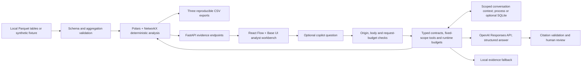

# Architecture and decisions

Decision date: 23 September 2026. Scope: Freedom Finance Money Graph. This is a local investigation prototype, not a production AML decision system.

## Acceptance contract

Load all three supplied Parquet tables and retain every node, including isolated seeds. Compute explainable financial roles, structural communities, a ranked investigation queue, and daily flow evidence. Export the exact required CSV schemas for every node, every cluster, and at least twenty priority accounts. Provide a directed graph, search by account ID, and a usable clean-machine launch without personal subscriptions. The graph pipeline must finish within five minutes on the supplied dataset; report measured performance separately from projections.

No learned accuracy is claimed because the supplied data has no labels. No automated blocking, suspicion filing, customer identification, external enrichment, full-bank coverage, or ownership inference is implemented.

## Runtime shape

The application has one Python service and a compiled browser bundle. It has no mandatory external database, queue, vector index, managed cloud service, GPU, or model download. The analysis object is computed once per process and read by HTTP handlers. Restart after changing the input directory; live ingestion is outside this prototype. Optional conversation persistence uses Python's bundled SQLite support; it does not alter the deterministic pipeline.

## ADR 1: deterministic analysis before language generation

Roles and rankings come from explicit numerical rules, graph structure, and observed dates. The model cannot write roles, scores, clusters, or submitted exports. A deterministic core makes numerical behavior inspectable and the demo resilient to provider latency, quota failures, and missing credentials. It also permits reproducibility tests that a free-form multi-agent committee would not satisfy.

A GNN is rejected for this build: no role labels or appropriate held-out ground truth are supplied. Training on synthetic laundering labels would create an unverified domain transfer and would not establish real-world detection performance. Unsupervised representations remain a future experiment against a transparent baseline, not a justification for a claim of guilt.

## ADR 2: Polars + NetworkX at this scale

Polars handles typed Parquet input and column aggregation. NetworkX provides accessible directed graph algorithms and explicit node preservation. At 2,248 nodes and 3,119 observed pairs, the operational cost of a separate graph database is unjustified. DuckDB is a credible alternative for larger analytical scans; adding both Polars and DuckDB here would duplicate the data layer.

NetworkX is not a promised million-node production architecture. At that scale: validate and aggregate in partitioned Parquet; materialize stable node/edge features; compute communities and centrality as offline versioned jobs; serve bounded subgraphs and precomputed ranks. Benchmark igraph, graph-tool, or cuGraph against the same feature contracts. Approximate expensive centrality with measured error. Use a database only when persistent incremental queries, multi-user cases, or transactional state require one. Graph GPU acceleration requires supported algorithms, graph conversion and memory checks; it is not automatic performance portability. [NetworkX backends](https://networkx.org/documentation/stable/reference/backends.html), [nx-cugraph](https://github.com/rapidsai/nx-cugraph).

## ADR 3: readable directed account network

React Flow 12.11.6 and Dagre 3.1.1 render a directed left-to-right account flow map. DOM-based circular account glyphs and labels support readable labels, keyboard selection and the existing Base UI components. The default view contains the selected entity and its three largest incoming and outgoing relationships; expansion is bounded to 25 loaded accounts and discloses omitted counts. The graph API independently caps results at 400 accounts and reports truncation. Minimum zoom preserves readable type rather than shrinking an entire network to fit. On mobile the exact transfer table is the default, with a pannable flow view available.

Edges retain their recorded direction, including cycles and self-transfers. No flow conservation or identity of funds is inferred from a path. PNG export captures the current viewport. The dated [visual investigation research](research/visual-investigation-ux-2026.md) compares React Flow, G6, Sigma, Reagraph, Cytoscape, ECharts and Nivo. GPU throughput and 3D rendering do not by themselves improve the investigator's ability to read a transfer. Supporting charts use the existing Recharts/shadcn Chart system rather than adding another general chart runtime.

## ADR 4: a modular agent with eight bounded read tools

The copilot HTTP facade composes `agent/contracts.py` (typed requests and answers), `agent/evidence.py` (tool registry), `agent/runtime.py` (provider execution and budgets), `agent/memory.py` (scoped context and evidence identity), `agent/offline.py` (deterministic local workflows and source receipts), and `agent/grounding.py` (checked observation fields and numerical-literal checks). The Responses loop is separate from deterministic analysis. Its tools are `inspect_selected_node`, `inspect_neighborhood`, `inspect_cluster`, `inspect_patterns`, `find_common_collectors`, `simulate_top_removal`, `inspect_missing_evidence`, and `inspect_investigation_brief`. The brief combines account observations, hypotheses, bounded signal examples and next-evidence requests in one read.

Tool arguments are empty objects; application code fixes the account and optional cohort of up to five existing accounts. The model cannot substitute account IDs, choose storage paths, execute SQL/Python/shell, follow URLs, modify files, or change graph scores. Resilience is a fixed top-five structural simulation. User questions, history and tool content remain untrusted data. Even a provider response requesting a tool after tools are disabled is rejected; unknown tools, nonempty arguments and repeated call IDs fail closed.

Account identifiers cross JSON/browser boundaries as canonical decimal strings, including nested paths, cohorts, sources and citations. This prevents JavaScript number rounding of int64 identifiers. Request validation accepts canonical nonnegative int64 strings or exact integer clients and normalizes them to engine integers; floats, booleans, noncanonical strings and out-of-range values are rejected. Metrics and community IDs remain numeric. The engine and all required CSV contracts retain their existing integer semantics.

Without an enabled provider, seven deterministic local workflows explain priority, review patterns, find cohort collectors, simulate top-five removal, plan missing-evidence requests, challenge a role hypothesis and prepare an investigation brief. Explicit slash presets and bounded phrase recognition select fixed tools; they cannot supply new account arguments. Each workflow performs one read, except the challenger, which performs two. Results carry actual source receipts and tool traces with zero model rounds. Unrecognized questions receive a labeled generic account summary. These workflows are useful local actions, not general natural-language understanding, autonomous planning or a model-based critique.

Each run permits at most three model rounds, four tool calls, 2,000 output tokens per round and 6,000 across the run. An 80,000-character context budget accounts for instructions, initial user/history content, tool/output schemas, replayed provider items and tool evidence; this is not a tokenizer count. Raw final output is capped at 12,000 characters before answer validation. A monotonic 45-second cooperative deadline is checked around provider and tool work, and each provider call receives the smaller of 20 seconds or the remaining budget, with SDK retries disabled. Synchronous work cannot be forcibly interrupted by these checks, so this is not a hard wall-clock or cancellation guarantee. Two provider runs can execute concurrently per process; a provider 429 starts a 30-second process-wide cooldown with local fallback.

The final round exposes no tools. Neighborhood evidence is bounded to 35 nodes and 60 edges, with a 24,000-character ceiling per tool result. Pattern reads include at most four routes and four cycles, three occurrences per route and eight dates per temporal category; collector context includes at most eight candidates. The compact brief has tighter sample bounds and explicitly discloses them. Repeated tool reads may use a per-run cache after argument validation. The visible trace reports tool status/cache use and timings, while execution metadata records rounds, calls, reported token usage, elapsed time and sanitized fallback codes.

The final answer has a strict JSON schema and locally validated size bounds. Citation IDs must have been retrieved in the current run. Each available citation source contains the bounded tool payload with account IDs normalized to strings, its exact canonical `source_json` string, a payload SHA-256 and an evidence version covering canonical dataset identity, engine source, signals and agent-module source. Verify the payload hash as SHA-256 of the exact UTF-8 bytes of `source_json`. The server produces this string with Python `json.dumps(source, default=str, allow_nan=False, sort_keys=True)`, using default separators and ASCII escaping; its 24,000-character ceiling applies before attaching the parsed source and canonical string. Downloads preserve `source_json` unchanged because browser reserialization of the parsed source changes numeric spellings such as `10000.0` to `10000`. Neither the formatted packet bytes nor a reconstructed parsed source are the hash input. These fingerprints identify evidence/code, not data authenticity or dependency provenance.

Provider answers may supply at most eight typed observation claims: a current cited evidence ID, a strict JSON pointer under `data` or `coverage`, and a scalar value. Trusted code checks the exact source field and returns its own label/value/unit. Unknown, missing, container, metadata/hash/token and mismatched-value references are rejected. Decimal comparison does not coerce large identifier strings through floating point. A separate conservative check compares numerical literals in answer prose with retrieved source numbers, allowing display rounding and K/M/B/percent formatting. It can reject an unsupported magnitude, but it cannot establish that a real number belongs to the claimed account, direction, date or explanation. Only observation fields are checked; prose semantic entailment is explicitly `not_checked`, and human interpretation review remains necessary. The check may reject a computed quantity or rule constant absent from retrieved evidence. Provider errors and failed validation return a clearly labeled local summary without exposing raw request/exception content. [Function calling](https://developers.openai.com/api/docs/guides/function-calling), [Structured outputs](https://developers.openai.com/api/docs/guides/structured-outputs), [Agent safety](https://developers.openai.com/api/docs/guides/agent-builder-safety).

LangGraph remains the preferred future option for recoverable workflows and review checkpoints; LangChain can supply selected adapters or middleware. Neither is required for this bounded runtime. Chroma is deferred until an authorized document corpus and retrieval evaluation justify it; Mem0 is deferred for explicitly approved preferences, never transaction truth. The current memory does not implement durable execution, checkpoint replay or analyst case decisions. [The complete hardening review](research/architecture-agent-hardening-2026.md) records researched tradeoffs and remaining work.

### Scoped conversation memory

Recent conversation context is bound to dataset/code version, selected account and sorted cohort. It contains at most six messages and 12,000 characters, across at most 128 sessions, expiring 24 hours from creation. The default store is process-local; `MONEYGRAPH_MEMORY_PATH` opts into a private SQLite file. Session tokens are random capabilities with only their hashes stored. They are not authenticated user identities. A SQLite file can survive a server restart, but browser chats/tokens are ephemeral and no cross-device restoration is implemented.

`POST /api/copilot/sessions` creates an empty, validated session before sending a question; it performs no provider work. The client then submits `remember=true` and its session token with the question. Stored sessions cannot import client-supplied history. Scope/version changes reject reuse, a lease prevents overlapping questions on one session, and bounded transcript pairs are retained only after completion; degraded fallback text is not added. `DELETE /api/copilot/sessions/{session_id}` removes active context. Deleted, expired or superseded sessions cannot be resurrected by a late completion. Expiry is enforced on store operations, so it is logical retention rather than a promise of timed physical erasure.

The browser resets server context when editing/regenerating a branch or after an uncertain canceled request, preventing superseded replies from contaminating the new branch. Deletion failures remain visible and retryable. Tokens stay outside browser persistence and exported transcripts. Conversation history helps interpret follow-ups; every new answer still retrieves current evidence and may not reuse an old citation as proof. Optional SQLite persistence does not provide encryption, backup erasure, multi-user isolation or durable agent workflows.

## ADR 5: model and privacy boundary

The default optional model is `gpt-6-sol` with low reasoning effort. Current official documentation describes function calling and structured output support; the provided project credential was checked against the live model list. GPT-6 Astra remains a quality benchmark candidate, not the default: official standard prices were $10/$50 per million input/output tokens versus Sol's $2/$10 at research time. No claim is made that Sol is superior on financial reasoning; compare both on the proposed evidence evaluation before changing defaults. [Sol](https://developers.openai.com/api/docs/models/gpt-6-sol), [Astra](https://developers.openai.com/api/docs/models/gpt-6-astra).

`MONEYGRAPH_AI_ENABLED` and `MONEYGRAPH_ALLOW_EXTERNAL_AI` must both be true and a server-side API key must be present. Defaults are false. Only bounded account evidence is sent after that opt-in. Responses use `store=False`. This disables response application-state storage; it does not establish Zero Data Retention or eliminate provider abuse monitoring. Organizer authorization, provider policy and account controls still determine whether real data can be sent. The offline path needs no key and remains fully functional. [OpenAI data controls](https://developers.openai.com/api/docs/guides/your-data).

Brev is an optional infrastructure management integration. Its `bak-` token is not an NVIDIA NIM inference API key. This workload does not require a GPU, so cloud compute is not provisioned merely because a credential exists.

## Agent engineering evaluation

Unit tests cover fixed tool scope, unknown/disabled/replayed tool rejection, run/context budgets, citation checks, exact int64 identifier transport, typed observation mismatches, numerical-literal checks, no response storage, bounded history and the seven local workflows. Source-receipt tests recompute hashes from the attached normalized payloads. Additional tests exercise version/scope rejection, SQLite restart, expiry, concurrent session leases, deletion with late replies, origin/body checks and rate-budget bypass attempts. Fake clients and clocks exercise failures without consuming provider credits. `scripts/evaluate_copilot.py` runs seven original synthetic scenarios in offline mode by default and accepts `--live` for a provider check. Scenarios cover factual evidence, depth boundaries, isolated seeds, attempted secret/shell access, five-account collectors, temporal patterns and removal simulation. A requested live evaluation requires provider-completed cases; absent configuration and local/fallback answers must not count as successful live-model evaluations. Report completed and fallback counts separately. These checks validate observable contracts and selected caveats; they do not establish semantic entailment, financial accuracy or comprehensive prompt-injection resistance. Final integrated tests, build and live-run results belong in [validation.md](validation.md); implementation presence alone is not a passing result.

Before widening agent autonomy, maintain a versioned evaluation set: (1) exact numerical questions, (2) boundary-account questions, (3) daily-versus-intraday ambiguity, (4) prompt injection requesting shell/URLs/secrets, (5) nonexistent accounts/citations, (6) network/quota failures, and (7) an unsupported accusation. Measure factual-number agreement, source validity, boundary caveat recall, abstention, latency, token usage, and fallback rate. Never score verbosity or confidence as correctness. Do not train against the small demo set and report it as a held-out benchmark.

## Deployment boundary

The local service binds to loopback and rejects untrusted Host headers. CLI serving disables access logs and proxy-header rewriting, so account/query/session values are not copied to routine access logs and rate-limit identity uses the transport peer, not submitted forwarding headers. Non-safe API methods require a trusted browser origin when browser provenance is present; origin-less native clients remain supported. Allowed development origins are the localhost/127.0.0.1 Vite port. CORS permits those origins to read errors and `Retry-After`; CORS itself is not access control.

Request middleware checks actual body bytes before JSON/Pydantic parsing: 96 KiB by default, including bodies without Content-Length, with a ten-second body receive deadline. Invalid/ambiguous framing, compressed bodies and non-JSON write requests are rejected. Validation errors use generic text instead of reflecting submitted inputs. API responses use `no-store`; browser responses include a restrictive CSP, denied framing, `nosniff`, no-referrer and disabled camera/microphone/geolocation. Optional API documentation has a separate CSP permitting its documentation assets.

Atomic token buckets refill at 240 API requests/minute per peer and 1,200 globally, with stricter 12-per-peer/30-global budgets for copilot question POSTs. Each configured rate is also the initial burst. Rejections return 429 and `Retry-After`; the client table is bounded to 1,024 peers. `.env.example` exposes rate/body settings. These budgets are per process, reset on restart and do not coordinate workers or enforce a provider billing ceiling.

The prototype has no authentication or multi-tenant authorization. Keep private data and paid model access on loopback. Shared deployment requires identity, per-case authorization, secure transport, shared request/cost accounting, retention and backup controls, secret management and tenant-isolation tests. The local safeguards and random session capabilities do not establish those properties.

## ADR 6: optional signals and reproducibility receipts

All eight optional brief categories are implemented as inspectable analytical features: observation boundaries, daily temporal patterns, recurring routes/return cycles, depth-peer and repeated-amount signals, node-removal sensitivity, natural-language graph assistance, generated dossiers, and prioritized requests for missing evidence. The criterion matrix records concrete coverage and verification. These features run separately from role assignment, so exploratory calculations cannot silently alter required exports.

The additional evidence receipt hashes canonical input records, the exact CSV bytes and the analysis source. Input-order invariance and output hashes are tested. A portable Markdown dossier carries observations, hypotheses, missing evidence and the dataset/algorithm receipt. This helps reviewers reproduce a case, but a hash alone does not authenticate the bank data or validate a hypothesis.

## ADR 7: complete Base UI dashboard and evidence-specific interaction

The application uses the official shadcn Base Nova dashboard foundation: its sidebar/inset layout, branded semantic tokens, self-hosted Inter typography, cards, tables, menus, tabs, fields, tooltips and responsive sheets. The registry is configured for Phosphor icons throughout. The initial compact custom green workspace was replaced following user feedback. Square UI's Dashboard 4 is the user-selected composition reference; Emails and Dashboard 2 were also inspected, but their source is not copied because the custom license carries redistribution restrictions. The official shadcn source is MIT. [The dated UI comparison](research/ui-ecosystem-2026.md) records source inspection and current versions.

Investigation keeps a large directed graph and an evidence inspector. Entities exposes the complete account set through filtered server pagination instead of a fixed first-500 list. Communities, Signals and Resilience have dedicated screens. At widths below 1,280 pixels, evidence uses an accessible side sheet. Base UI owns portal positioning, keyboard interactions and focus restoration. The latest user-selected [Freedom Finance reference](research/freedom-ui-reference.md) informs white surfaces, a pale cool gray-green canvas, near-black typography, bright green actions and a charcoal active navigation row. The desktop graph and assistant workspace adapt the observed mobile banking language; the generated Aqsha Lens mark uses an original charcoal A and green flow band, with embedded generation metadata and a provenance sidecar. Overview adds a compact community distribution chart, role composition, coverage rows and priority review queue using actual dataset values. Role colors have a visible graph legend. Community colors share one mapping across views, with community IDs shown explicitly. Both the sidebar and desktop evidence panel can collapse; assistant state belongs to the global runtime independently of the inspector. Movement is limited to a short workspace entrance, sidebar changes and component feedback; reduced-motion preferences are respected.

The copilot uses assistant-ui 0.15.21 LocalRuntime in a global workspace, with a single mounted runtime and fixed account/cohort scope per conversation. Closing, docking/expanding or changing responsive presentation preserves browser runtime state; navigating another account does not silently retarget an existing conversation. Visible chats support switching, rename, export and deletion and last until browser refresh. The custom adapter uses bounded server conversation context described in ADR 4. Retry/edit branches reset incompatible context; deleting a conversation requests server deletion before removing it locally. Cancellation aborts browser waiting and does not claim that already-running server/provider work has stopped.

Messages render real server mode, validated evidence references and tool traces. Local replies identify their deterministic action; provider replies can show separately checked observation fields. A checked field never gives the surrounding model prose a verified badge. Citation source snapshots and a bounded evidence packet are local download artifacts containing available evidence, receipts and answer context; they are not authenticated reviewer decisions or durable case records. Session capabilities, credentials and raw provider state remain outside exports. Missing source snapshots, including degraded summaries without a successful read, must not be represented as complete evidence packets.

Markdown HTML and images are disabled; generated links are inert. Only separately validated evidence citations navigate within the application. Answers appear after the JSON response arrives, with no simulated token streaming. The assistant and Markdown renderer are separate lazy-loaded chunks. No browser OpenAI key, client-side execution tool, managed assistant cloud or browser-persistent transcript store is configured. Optional server SQLite context is separate from the assistant-ui conversation list. assistant-ui includes Radix dependencies internally; Base UI is the application's direct primitive choice, not a claim that the complete dependency tree is Radix-free.
