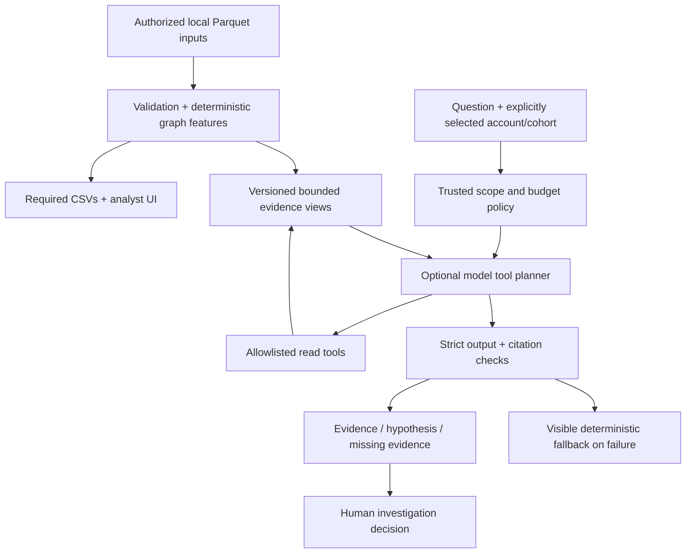

# Money Graph: advanced agent design, optional features and evaluation

Research date: **23 September 2026**. This document distinguishes researched capabilities, recommended architecture and proposed experiments. The [criteria matrix](../criteria-matrix.md), [acceptance plan](../acceptance.md), tests and measured validation determine what the application actually delivers. Read alongside [architecture.md](../architecture.md), [methodology.md](../methodology.md) and the [ecosystem comparison](ecosystem-2026.md).

## Architecture recommendation

The strongest fit is an **evidence-driven investigation agent over a deterministic financial graph**. The agent decides which allowed evidence view helps answer a question. Trusted code validates that request, calculates the answerable facts, and controls scope. The language model explains observations and uncertainty; it does not assign required roles, alter scores, execute queries, or invent missing customer attributes.

This is a meaningful agent even with one model and a small tool set. Adding autonomous specialists is justified when independent investigations, durable human review or materially better measured answers require them. A larger agent team otherwise adds latency, cost, inconsistent assumptions and more places for unsupported conclusions to enter.

External research during development is distinct from data enrichment at runtime. Exa is appropriate for researching frameworks and public methods. It must not become a way for the app to infer identities, income, employers or other unavailable attributes about organizer accounts: the official brief forbids that enrichment.

The current implementation validates output schema and citation membership. It instructs the model to match numbers to evidence, but does **not** automatically prove numerical agreement or claim entailment. Automated numerical verification is a proposed next-stage improvement; an analyst must presently inspect the cited evidence for material claims.

## What is current in September 2026

| Option | Verified current capabilities | Best use here | Why not automatically adopt |
|---|---|---|---|
| [OpenAI Agents API](https://developers.openai.com/api/docs/guides/agents) | Managed Codex harness, saved sessions, compaction, tools and multi-agent orchestration; public beta announced 10 September 2026 | Future long-running managed investigations if data/state policy permits | Service-managed state and beta lifecycle add considerations to a local bounded app. It is distinct from the Agents SDK and Responses API. |
| [OpenAI Agents SDK](https://openai.github.io/openai-agents-python/) | App-owned runtime, function tools, structured outputs, handoffs, sessions, guardrails, tracing and approval support | First migration option for a richer OpenAI-centric copilot | Framework defaults still need scope checks, budgets and trace-data policy. SDK guardrails are not permission boundaries by themselves. |
| [LangGraph](https://docs.langchain.com/oss/python/langgraph/durable-execution) | Explicit state graph, checkpoints, stores, interruption/resume and recovery | Best when a case spans hours, human review or process restarts | Durable storage, retention and identity become real requirements. An in-memory checkpointer is not durable across restarts. |
| [Deep Agents](https://github.com/langchain-ai/deepagents) | Ready harness with planning, subagents, context management, memory and pluggable filesystem/sandbox backends | Long-horizon research reference | Its filesystem/shell affordances are outside our authorized runtime tool surface. Do not expose a host filesystem backend to bank data. |
| [PydanticAI](https://pydantic.dev/docs/ai/core-concepts/agent/) | Typed dependencies, output types/validators, tools, usage limits, streaming and multiple durable integrations | Strong alternative for a typed evidence-agent service | Type correctness does not establish scope authorization, financial correctness or safe retry behavior. |
| [NeMo Agent Toolkit 1.8](https://docs.nvidia.com/nemo/agent-toolkit/latest/) | Framework integration, workflow profiling, evaluation, tracing, MCP and A2A | Add when profiling/comparing several agent workflows | An additional integration layer does not improve evidence quality by itself. |
| [DSPy / GEPA](https://dspy.ai/getting-started/gepa-optimization/) | Optimization against task examples and metrics with reflective feedback | Optimize prompts/model choice after defining a reliable held-out evaluation | Requires representative cases and a sound metric; otherwise it optimizes the wrong target. |
| [Langflow](https://github.com/langflow-ai/langflow), [Dify](https://github.com/langgenius/dify), [n8n](https://github.com/n8n-io/n8n) | Ready visual building blocks, workflows and integrations | Fast internal experiments or surrounding case automation | More runtime services, broad connectors and platform governance. Dify/n8n license conditions differ from MIT. |

The managed Agents API can use `environment.type: "none"`; a sandbox is not mandatory for every agent. With that option its built-in Bash/apply-patch and workspace files are unavailable. This is the suitable managed-harness starting point if evaluated later, rather than giving a financial copilot broad execution rights. [Agents API architecture](https://developers.openai.com/api/docs/guides/agents-api/architecture).

**Avoid starting a new dependency on Agent Builder.** Its current official safety page announces deprecation and a scheduled 30 November 2026 shutdown. ChatKit is listed separately as remaining available. The page still contains older model examples; use current model documentation and measured task evaluations rather than treating an old example as the latest model recommendation. [Official notice](https://developers.openai.com/api/docs/guides/agent-builder-safety).

## Three architecture tiers

### Tier 1: submission-ready bounded evidence loop

One local service owns analysis, authorization and outputs. A selected account or explicit cohort fixes the request scope. The current implementation exposes **seven fixed, empty-argument read tools**, with at most **three model rounds and four total tool calls**: selected node, neighborhood, cluster, patterns, common collectors, top-node removal and missing evidence. A cohort contains **one to five selected accounts**. Keep the current direct Responses loop unless a required capability is missing; the small integration surface is easy to test offline.

The following are design invariants, regardless of SDK: maximum rounds and calls; finite question/output lengths; request and overall deadlines; bounded queued and concurrent requests; strict tool argument schemas; no model-controlled URLs, SQL, shell, file paths or credentials; fail-closed unknown tools; read-only evidence; explicit external-AI opt-in; predictable local fallback. Total budgets include retries and subordinate work, not just visible agent turns.

### Tier 2: typed agent with stronger evaluation

If tool count, streamed events or reusable agent sessions grow, migrate behind the same evidence service to **OpenAI Agents SDK or PydanticAI**, not both. Reuse the exact schemas and authorization tests. Add per-request typed dependencies containing case scope, evidence version, capability set, deadline and remaining budget. Those values are created by trusted code, never by model output. PydanticAI's dependency injection and usage limits are concrete conveniences for this design. [Dependencies](https://pydantic.dev/docs/ai/core-concepts/dependencies), [agent limits](https://pydantic.dev/docs/ai/core-concepts/agent/).

Preserve the finite-state business workflow around the agent. Tool success is not investigation success. A successful run returns a validated account/cohort answer or explicitly reports that the available evidence cannot answer the question.

### Tier 3: durable multi-agent investigation

For a real case-management product, use a checkpointed graph with these bounded stages:

1. **Scope and plan:** trusted application validates selected accounts and permitted evidence; a planner chooses among predefined investigation templates.
2. **Independent evidence workers:** deterministic topology, temporal flow and observation-completeness jobs run concurrently against the same data fingerprint.
3. **Hypothesis writer:** model assembles an explanation from immutable evidence IDs; every material claim links to facts and distinguishes alternatives.
4. **Verifier:** deterministic number/citation checks first; optional model critique identifies unsupported inferences but cannot promote a hypothesis to fact.
5. **Analyst review:** a human records disposition, requests more data or closes the review. Persist and resume across process restarts.

LangGraph is well suited to these checkpoints and state transitions; the OpenAI SDK also documents durable integrations such as Temporal, Restate and DBOS. Choosing a framework does not remove the need to design idempotency, versioned state, retention, concurrent-update behavior and recovery tests. [LangGraph persistence](https://docs.langchain.com/oss/python/langgraph/durable-execution), [SDK durable integrations](https://openai.github.io/openai-agents-python/running_agents/).

Do not use a free-form “risk agent votes with a compliance agent” system to assign the official role CSV. Multiple models can agree on the same unsupported premise. The verifier must have a different job and deterministic checks, not merely another confident opinion.

## Evidence tools that unlock the official optional features

This is the target capability contract, not a requirement to expose each feature as a separate LLM tool. Several can be returned together to reduce calls. Scope is application-selected; model arguments may only narrow it within explicit limits.

| Evidence view | Trusted input bounds | Output | Failure / uncertainty behavior |
|---|---|---|---|
| Node card | One existing selected `gid` | Role fit, priority components, exact amounts/degrees, depth, key counterparties, evidence IDs | Missing account is an error; depth-four status remains an observation boundary |
| Neighborhood | Selected node; fixed hop/node/edge caps | Directed edges and selected nodes with truncation metadata | Report that omitted neighbors exist; never imply visible neighborhood is complete |
| Cluster | Existing selected cluster; bounded representatives | Size, seeds, internal turnover, structural explanation | Graph community is not a proven organization or fraud ring |
| Cohort common collectors | Explicit selected cohort of 1–5 accounts; fixed search depth of at most three hops | Accounts reachable from every selected account, with supporting directed paths and bounded evidence | Reachability is not direct receipt: label intermediaries and path length. An empty intersection is a valid answer |
| Daily flow signals | Selected account/cohort and observed date window | Inflow/outflow by date, 1–2-day overlap, payer synchrony and bursts | Date-level ordering only; no intraday or identical-fund provenance claim |
| Repeated paths / return flow | Bounded path length and result count | Directed route evidence, dates and recurrence; reciprocal/SCC/cycle indicators | A structural cycle is not automatically temporally ordered return of the same money |
| Depth-peer anomaly | Selected account with adequately sized observed depth cohort | Robust feature percentile/deviation, sample size and contributing features | No calibrated fraud probability; suppress or qualify tiny cohorts |
| Removal simulation | Explicit selected/ranked nodes; capped N | Components, giant-component size and connectivity changes before/after | Counterfactual on observed graph; no claim about real-bank causal disruption |
| Missing-evidence request | Derived from gaps and candidate hypothesis | Ranked request for dates, missing hops, inbound coverage or richer timestamps | Request authorized data; do not fill unknown attributes using public enrichment |

For the brief's example, “Who collects money from these five?”, direct collectors can be computed as an exact intersection of immediate recipients. The implemented tool answers the broader, explicitly labeled question of **shared reachability within three hops**, with directed path evidence. A reachable account must not be described as receiving a direct payment from each selected account unless the corresponding direct edges exist. The model explains the computed result and coverage; it does not guess the intersection.

## Full official optional-feature design

The [Freedom brief](https://docs.google.com/document/d/1JPLU-G6R25Ge2hVaY2J9cqvrx7FGExj87XKwJPaMz3o/edit) lists eight optionals. They are independent of whether AI is enabled.

| # | Official optional | Recommended implementation | Judge-visible proof | Important limit |
|---:|---|---|---|---|
| 1 | Account for graph truncation | Separate observed no-outflow from depth-four boundary; display observed depth and unmet evidence | Compare a depth-four account, shallower apparent sink and isolated seed | The dataset cannot conclusively establish a true final beneficiary |
| 2 | Temporal patterns | Daily flow series; deterministic 1–2-day overlap, burst and same-day multiple-payer indicators | Dates, amounts, payer counts and exact rule in a card | July dates have no intraday timestamps; overlap is not traced fund identity |
| 3 | Repeated routes and returns | Aggregate repeated directed pairs; bounded A→B→C motifs; reciprocal flows/SCCs and dated cycle evidence | Highlight actual directed path and supporting transactions/days | Do not enumerate all simple cycles unboundedly; distinguish structural and temporal claims |
| 4 | Anomalies and splitting | Depth-relative robust amount/degree profiles; repeated observed amounts, concentrations and near-visible-threshold patterns if justified | Peer cohort, thresholds and numeric deviation | Below-threshold transfers are absent, so hidden splitting cannot be measured or ruled out |
| 5 | Network resilience | Remove top-N selected nodes on a graph copy; recompute weak components and largest component; report incident amounts separately | Before/after component comparison with reproducible N | Structural connectivity is not transaction loss or prevention benefit |
| 6 | Natural-language analyst assistant | Bounded tools with node citations; common-collector cohort query; deterministic offline equivalent | Ask about selected accounts, then inspect facts and trace | No arbitrary query/execution and no model-written role output |
| 7 | Automatic node card | Local template populated with computed facts; optional model wording after validation | Downloadable/readable role, flow, connections and attention points | The card must work without an API key |
| 8 | Completeness assessment | Rules turn known gaps into specific next-data requests | “Need outgoing edges beyond hop four” or “need intraday timestamps to establish ordering” | Missing data is not negative evidence and must not be imputed as zero |

The primary numerical contracts remain exact: all input nodes, including isolates; role evidence at most 200 characters; `nodes_roles.csv`, `clusters.csv` and `top_nodes.csv` with official schemas; a ranked list of at least 20 nodes on the supplied graph; clean local launch and under-five-minute analysis. Optional features must not change those schemas or make cloud access mandatory.

## Additional features with high demo value

These are ranked proposals. Ship only those with working evidence and tests; label unbuilt items as roadmap.

| Priority | Feature | Why it helps win | Minimal coherent delivery | Honest metric |
|---|---|---|---|---|
| 1 | **Evidence passport** | One place connects graph, role rule, transactions and limitations; directly answers an arbitrary judge-selected gid | Node card with data fingerprint, rule version, fact IDs, supporting dates and missing evidence | Time to explain three arbitrary accounts; citation validity |
| 2 | **Ask what would change the conclusion** | Shows reasoning discipline and exposes incomplete evidence instead of overclaiming | Missing-evidence panel tied to role/pattern: extra hop, earlier/later period, inbound transfers, timestamps | Coverage of known gap types; no fabricated fields |
| 3 | **Selected cohort investigation** | Makes the official five-payer assistant example concrete and visual | Select up to five accounts, compute common reachable accounts within three hops, display each supporting path and explain direct/indirect coverage | Exact match against deterministic reachability intersections |
| 4 | **Network removal experiment** | A fast, visual before/after demonstrates business usefulness | Remove selected top-N accounts in a copy, show component deltas and restoration | Recomputed component counts; original graph unchanged |
| 5 | **Evidence-backed case capsule** | A judge can review a finding without trusting the live model | Local JSON/Markdown download containing facts, hypotheses, caveats, data/rule fingerprints and trace metadata | Reproducible facts; no raw credentials or provider prompt leakage |
| 6 | **Priority sensitivity view** | Separates stable candidates from threshold artifacts | Compare ranking under documented small weight/threshold perturbations; show rank interval/Jaccard | Measured stability on observed graph, not confidence of crime |
| 7 | **Red-team demonstration** | Shows the assistant obeys application controls under pressure | A synthetic question requests shell access, role rewriting or a fabricated identity; show rejection/fallback | Unauthorized tool executions = 0 |
| 8 | **Model comparison lab** | Makes “advanced AI” a measured engineering decision | Same synthetic questions, locked evidence and grading run on chosen model alternatives | Exact-number agreement, unsupported-claim rate, latency, tokens, fallback rate |

The first five reinforce official requirements or optionals. Sensitivity and model experiments are valuable only after the required pipeline is complete. A polished visualization cannot substitute for CSV coverage or truthful boundary treatment.

## Security engineering beyond prompt guardrails

| Threat | Application control | What the model cannot be trusted to enforce |
|---|---|---|
| Prompt injection in question/tool content | Put untrusted text in user/data channels; strict schemas; allowlisted read tools | “Ignore malicious instructions” is not an authorization mechanism |
| Account/tenant escape | Validate user-authorized scope before every tool call; pass scope outside model arguments | Model-provided `gid`, case ID or tenant ID is not proof of access |
| Expensive traversal or runaway agent | Cap nodes, edges, path length, calls, rounds, tokens, concurrency and elapsed time | Framework default recursion limit alone does not cap all work |
| Retry amplification | One explicit retry policy; total deadline includes SDK/transport retries | Per-attempt timeout is not an end-to-end deadline |
| Invented citations | Return registered evidence IDs; reject unknown IDs; require claims tied to evidence | Valid JSON or a real node ID does not prove entailment |
| Numeric distortion | Calculate numbers in code and pass units/rounding; analyst verifies reported values today; automatic claim-to-number validation is proposed | LLM arithmetic and polished wording are not a source of truth |
| Secret or data leakage | Server-side secrets; opt-in external model; no general network tools; redacted traces | `store=False` alone is not Zero Data Retention |
| Model-generated score tampering | Keep analysis/export objects immutable to agent; no write tools | A “risk analyst agent” has no authority to change required roles |
| Supply-chain drift | Lock versions, review license/source, pin reviewed templates, inspect updates | Stars and a recent commit do not imply safe dependencies |

PydanticAI documents how output-validation retries, SDK retries and transport retries can multiply. Its `request_limit` counts model requests, not necessarily every underlying wire retry; account for this explicitly. [Retry guidance](https://pydantic.dev/docs/ai/core-concepts/retries/).

If MCP is later exposed for another application, use the **2026-07-28** authorization/security guidance: audience-bound tokens, resource indicators, PKCE, exact redirect validation and secure token storage; do not forward a client's bearer token indiscriminately to downstream services. Protect metadata discovery against SSRF and use per-client consent for proxy flows. MCP connectivity supplies a protocol, not business authorization. Local in-process tools currently avoid this additional boundary. [Authorization security](https://modelcontextprotocol.io/specification/2026-07-28/basic/authorization/security-considerations), [MCP best practices](https://modelcontextprotocol.io/docs/2026-07-28/tutorials/security/security_best_practices).

Tracing needs deliberate privacy configuration. The OpenAI SDK exposes both tracing disablement and a sensitive-data flag; a developer choosing a framework must configure these, rather than assume traces omit tool contents. Langfuse/Phoenix can support evaluation, but self-hosting, access controls, redaction and retention must be handled separately. [SDK tracing settings](https://openai.github.io/openai-agents-python/running_agents/).

## Speed and model choice

The first speed optimization is **avoid unnecessary model work**: all sums, role decisions, cohort intersections, motifs and exports are deterministic; a node card can be generated locally. Bundle independently available facts, use a stable instruction/tool prefix, put dynamic evidence afterward, restrict output length and cache local analysis by dataset/rule fingerprint. OpenAI documents stable-prefix prompt caching and context/output reduction, but actual benefit must be measured on our workload. [Latency](https://developers.openai.com/api/docs/guides/latency-optimization), [prompt caching](https://developers.openai.com/api/docs/guides/prompt-caching).

The current implementation's optional **GPT-6 Sol** default is a practical starting candidate; **GPT-6 Astra** should be a higher-cost comparison candidate, not assumed superior for this task without evaluation. Use current official model pages and the live project's available-model list, record the exact model identifier/date and preserve an offline fallback. Test an open-weight/NIM model only through the same strict tool/schema/citation suite; inference availability is not evidence of tool-calling reliability. [Sol](https://developers.openai.com/api/docs/models/gpt-6-sol), [Astra](https://developers.openai.com/api/docs/models/gpt-6-astra).

Current Responses WebSocket documentation supports multiplexed streams for long tool-heavy workflows. The Agents SDK running guide has different connection-limit wording, so transport behavior is version-sensitive. A three-round investigation should first be optimized through fewer/smaller calls; do not import a headline long-chain speedup as this application's measured gain. [WebSocket mode](https://developers.openai.com/api/docs/guides/websocket-mode), [SDK guide](https://openai.github.io/openai-agents-python/running_agents/).

## Accuracy evaluation and release gates

No ground-truth role or laundering labels exist in the supplied dataset. Therefore role accuracy, precision, recall, AUC and probability of guilt cannot be honestly measured from it alone. Evaluation must separate **contract correctness**, **synthetic behavior**, **answer faithfulness**, and **analyst usefulness**.

| Layer | Cases | Metrics / release gate |
|---|---|---|
| Input and export contracts | Isolated seed, boundary node, duplicate/missing IDs, edge/transaction mismatch, malformed amounts | Full node coverage; exact schemas; deterministic ordering; clear invalid-input rejection |
| Graph features | Known fan-in/fan-out, path, reciprocal cycle, disconnected components, node-removal fixture | Exact expected counts/sums/components; stable results across reruns |
| Temporal semantics | Same-day ambiguity, next-day overlap, month edge, repeated route, missing timestamp | Correct dates and amounts; no unsupported intraday ordering |
| Agent authorization | Unknown tool, arbitrary URL/SQL/shell request, account escape, over-limit cohort, oversized output | Zero unauthorized executions; finite budget; visible safe fallback |
| Answer grounding | Exact numerical question, unsupported allegation, nonexistent node, boundary sink, common collector | Valid citations; number agreement; boundary caveat recall; appropriate abstention |
| Reliability | Provider timeout, quota error, malformed JSON, invented evidence ID, queue saturation | Local graph and exports remain usable; no secrets/raw exception bodies in logs |
| Performance | Cold full pipeline, warm API, selected graph render, end-to-end copilot | Actual p50/p95 where enough runs exist; document hardware and sample count |
| Analyst utility | Blind review of priority list against amount-only and degree-only baselines | Reviewer usefulness and verification time; mark unperformed study as planned |

For a first agent evaluation set, use at least 24 synthetic cases spanning numeric answers, boundary interpretation, unsupported allegations, cohort intersections, missing data and injection attempts. Generate expected values from independently specified fixtures, not by blindly snapshotting the implementation. Freeze a held-out subset before prompt changes. Deterministic scorers should check numbers, evidence IDs and access behavior; use human or model rubric review only for claims that exact matching cannot assess. A model grader must not be the sole judge of itself.

Inspect AI provides ready evaluation components and agent bridges, including token/message/time/cost limits. Langfuse or Phoenix can collect traces and annotations for the later feedback loop. DSPy/GEPA can optimize after the metric is credible; do not optimize on the final held-out cases. [Inspect agents](https://inspect.aisi.org.uk/agents.html), [Inspect limits](https://inspect.aisi.org.uk/setting-limits.html), [DSPy GEPA](https://dspy.ai/getting-started/gepa-optimization/).

Before claiming completion: run backend tests and a frontend production build, verify the supplied-data CLI and exact exports, inspect the working graph and cohort flow, and demonstrate offline mode. Research breadth, GitHub stars and framework novelty are supporting evidence for engineering choices; the running, explainable result is the submission.
