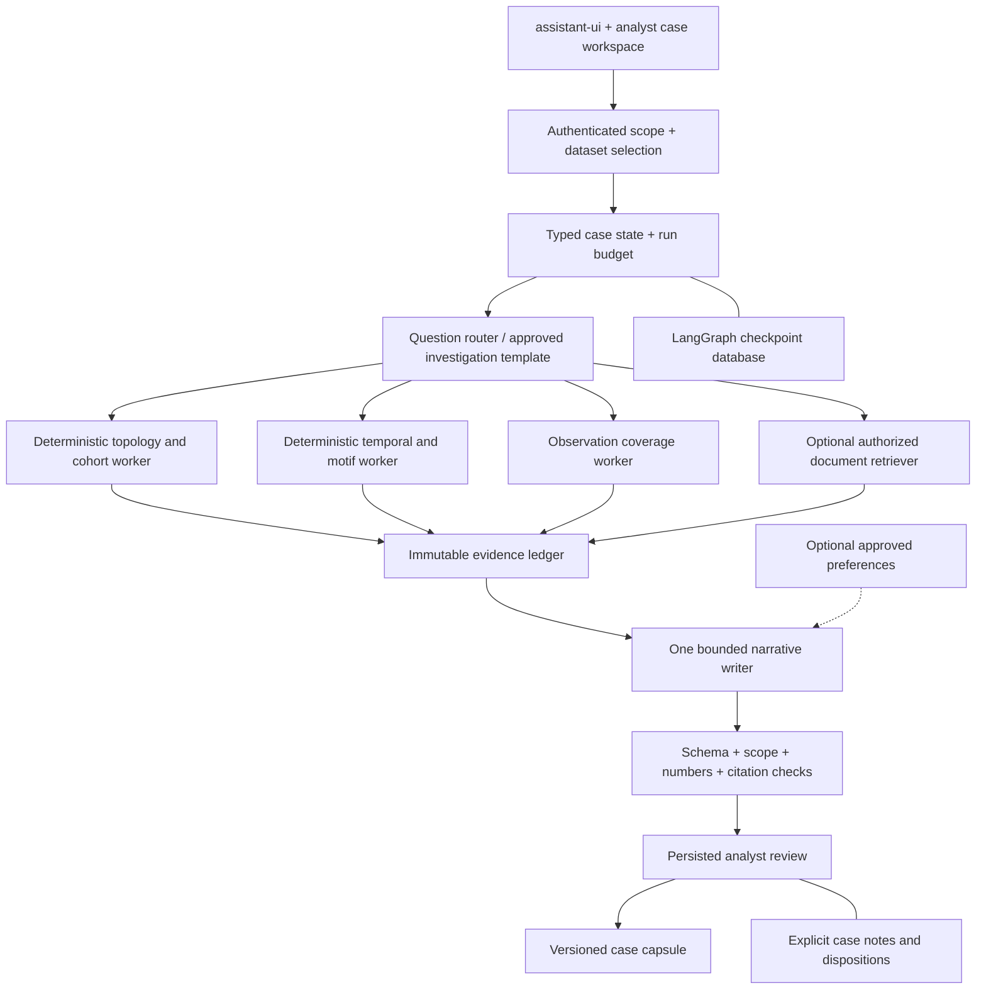

# Agent architecture improvements for Money Graph

Research snapshot: **23 September 2026**. This report extends [the original agent research](advanced-agents-2026.md), after inspecting the implemented copilot, methodology and architecture. Recommendations below are **not implemented features**. The current application remains the bounded, read-only Responses API agent described in [architecture.md](../architecture.md).

**Recommendation:** improve evidence coverage, numerical verification and case continuity first. Use **LangGraph with a persistent checkpointer** when implementing resumable analyst cases. Add a document retriever only for an authorized document corpus. Keep Mem0 optional and restricted to approved preferences. Neither a vector database nor inferred memory should become the source of transaction facts.

Exa reviewed **69 requested results across seven research workstreams**, yielding 65 distinct search URLs. Sixteen page URLs were fetched directly. Technical conclusions use primary documentation or repository source; irrelevant and stale candidates were excluded. Live GitHub metadata covers 18 repositories, with exact default-branch commits, licenses and package snapshots in [the metrics file](agent-improvements-github.json). Queries and URLs are recorded in [the source ledger](agent-improvements-sources.json). Stars measure adoption, not correctness or security. No competing framework was benchmarked in this research.

## 1. Decisions that matter for this application

| Decision | Selected direction | Reason |
|---|---|---|
| Financial ground truth | Keep Polars/NetworkX calculations and exact CSV generation independent of AI | All requirements and optionals must work offline; the dataset provides no ground-truth crime labels |
| Agent runtime now | Keep the small existing Responses adapter while strengthening its evidence contract | Replacing orchestration does not fix unsupported numerical statements |
| Next runtime | LangGraph `StateGraph`, SQLite checkpointer locally, PostgreSQL for a shared service | Explicit investigation stages, persisted review and recovery match case work |
| LangChain | Use provider adapters and selected middleware inside that graph when they remove code | `create_agent` already returns a LangGraph graph; it is not a second independent orchestration service |
| Retrieval now | Exact graph APIs and document section lookup; optional lexical retrieval | Numeric graph questions require complete deterministic calculations, not nearest-neighbor text search |
| Retrieval later | Chroma for a local document prototype; PostgreSQL plus pgvector if the product already uses PostgreSQL | Keep one evidence contract while selecting infrastructure according to deployment needs |
| Long-term memory | Explicit typed case records first; optional approved analyst preferences | Separate analyst notes, remembered preferences and model hypotheses from observed facts |
| Observability/evaluation | Local structured events plus Inspect AI; later self-hosted Langfuse if needed | Begin with measurable authorization, grounding and latency tests; add a trace service when its UI is useful |
| Multi-agent execution | Parallel deterministic evidence workers, one bounded writer, deterministic verifier | Independent jobs can improve coverage without several models inventing competing versions of facts |

LangChain documents that middleware runs inside the compiled LangGraph returned by `create_agent`. Its ready middleware includes model/tool limits, human review, retries, fallback, summarization and context editing. Adopt only the needed pieces; do not expose its shell or filesystem affordances to this application. [Agent middleware](https://docs.langchain.com/oss/python/langchain/middleware/overview), [available middleware](https://docs.langchain.com/oss/python/langchain/middleware/built-in).

## 2. Concrete gaps in the implemented agent

The code audit inspected `src/moneygraph/copilot.py`, not an imagined future agent. Existing protections are valuable: seven allowlisted read tools, application-selected account/cohort, empty tool arguments, strict schemas, citation membership checks, two concurrent requests, a visible offline fallback, no model-written role CSVs and no arbitrary execution.

| Current behavior | Consequence | Recommended change |
|---|---|---|
| Three model rounds; tools disabled in the final round; parallel tool calls disabled | A normal run has only two tool-bearing rounds. A four-call ceiling does not promise four independent evidence views | Supply a compact trusted node/boundary context before planning; route to a bounded evidence bundle for the question |
| Citation IDs such as `node:123` are accepted when retrieved | A real citation can accompany an incorrect number or unsupported interpretation | Version evidence and add structured claims with deterministic field/value checks |
| Citation navigation uses the selected gid for every citation | A collector, cluster or resilience citation cannot directly identify its specific evidence view | Return a typed citation target: node, cluster, route, collector, simulation or document section |
| `OpenAI(timeout=20.0, max_retries=0)` applies to individual API requests | Several rounds can exceed 20 seconds; this is not a whole-run deadline | Pass a monotonic deadline through all model/tool work and stop when the remaining budget is exhausted |
| UI conversations are in memory; the server receives the latest question only | A visible conversational thread is not durable case memory or server conversational memory | Introduce explicit case state and versioned evidence references; preserve the current honest UI wording until then |
| Tool payloads are bounded independently | Bounded examples can omit material evidence; a model can mistake a sample for exhaustive search | Report searched scope, searched count, returned count, truncation and reason on every bounded view |
| Model output separates answer and limitations, but not individual claims | Caveats can exist while an unsupported sentence remains in the answer | Render observations, hypotheses and missing evidence as typed claim groups |
| Browser cancellation aborts waiting | Server/model work may continue | Track a server run ID and cancellation state before claiming end-to-end cancellation |

These are engineering findings, not evidence that the current agent produced a harmful answer. The existing seven synthetic live cases test contracts; they do not establish financial accuracy or answer entailment. Preserve that distinction in the demo.

## 3. Maintained off-the-shelf shortlist

Exact GitHub star counts were read on 23 September 2026. HEAD dates are default-branch **committer dates**, not release dates. Full SHAs are in the metrics file. Package versions are separate PyPI snapshots and have not been installed or compatibility-tested together.

| Project | Stars | HEAD date | License checked | Fit and decision |
|---|---:|---|---|---|
| [LangChain](https://github.com/langchain-ai/langchain) | 146,918 | Sep 23 | MIT | Provider adapters and middleware; use selectively |
| [Mem0](https://github.com/mem0ai/mem0) | 65,877 | Sep 22 | Apache-2.0 | Optional preference retrieval; not financial evidence storage |
| [LangGraph](https://github.com/langchain-ai/langgraph) | 42,172 | Sep 23 | MIT | Preferred durable case-workflow upgrade |
| [Qdrant](https://github.com/qdrant/qdrant) | 34,760 | Sep 3 | Apache-2.0 | Dedicated vector service if retrieval scale justifies another service |
| [Langfuse](https://github.com/langfuse/langfuse) | 34,961 | Sep 23 | MIT core; commercial enterprise directories | Trace, dataset and annotation UI; privacy configuration required |
| [Graphiti](https://github.com/getzep/graphiti) | 31,094 | Sep 21 | Apache-2.0 | Temporal context for evolving narrative records; separate from transaction graph |
| [Deep Agents](https://github.com/langchain-ai/deepagents) | 29,683 | Sep 23 | MIT | Planning/context harness reference; generic filesystem/shell features exceed current scope |
| [OpenAI Agents SDK](https://github.com/openai/openai-agents-python) | 29,652 | Sep 22 | MIT | Good lower-friction alternative if only tools, sessions and events grow |
| [Chroma](https://github.com/chroma-core/chroma) | 29,357 | Sep 21 | Apache-2.0 | Simple local document-retrieval prototype |
| [Promptfoo](https://github.com/promptfoo/promptfoo) | 25,392 | Sep 23 | MIT repository metadata | Regression and adversarial evaluation candidate; inspect configured providers/plugins |
| [pgvector](https://github.com/pgvector/pgvector) | 23,132 | Sep 22 | PostgreSQL license | Avoid a second datastore when production already needs PostgreSQL |
| [PydanticAI](https://github.com/pydantic/pydantic-ai) | 20,129 | Sep 23 | MIT | Strong typed alternative to the selected runtime; do not add a second agent loop |
| [DeepEval](https://github.com/confident-ai/deepeval) | 18,410 | Sep 23 | Apache-2.0 | Ready evaluation components; calibrate model-graded metrics on this task |
| [Phoenix](https://github.com/Arize-ai/phoenix) | 11,584 | Sep 23 | Root: Elastic License 2.0 | Useful observability/evaluation candidate; inspect package-specific terms before reuse |
| [Inspect AI](https://github.com/UKGovernmentBEIS/inspect_ai) | 2,847 | Sep 22 | MIT | Preferred independent Python evaluation harness |
| [DBOS Python](https://github.com/dbos-inc/dbos-transact-py) | 1,586 | Sep 22 | MIT | In-process durable alternative if ordinary Python workflows fit better than graphs |
| [ThreatSight 360](https://github.com/mongodb-industry-solutions/fsi-aml-fraud-detection) | 14 | Sep 1 | MIT | Closest substantive AML architecture reference; Atlas/Bedrock-specific |
| [AML investigation prototype](https://github.com/serey-roth/aml-investigation) | 0 | May 12 | No license detected | Read-only product reference; not an adopted code dependency |

Version snapshot: LangChain **1.4.2**, LangGraph **1.2.12**, SQLite checkpointer **3.1.1**, PostgreSQL checkpointer **3.1.2**, Chroma **1.5.9**, Mem0 **2.1.0**, Graphiti **0.30.2**, PydanticAI **2.48.0**, OpenAI Agents **0.22.3**, Inspect AI **0.3.268**, Langfuse **4.15.4**, Phoenix **20.15.0**, DeepEval **4.2.5**, DBOS **3.0.0**. Check compatibility and lock exact resolved versions during implementation. A September HEAD does not mean every package has a September release: Chroma's observed PyPI version was uploaded in May. [Snapshot sources](agent-improvements-github.json).

There is no verified high-star, drop-in repository that already satisfies this hackathon's Parquet schemas, boundary rules, CSV contracts and local deployment. The practical off-the-shelf strategy is to combine maintained infrastructure components with the small domain-specific evidence service already built.

## 4. Target architecture: a case workflow with explicit evidence

This diagram is a proposed architecture. `GRAPH`, `TIME` and `GAPS` can initially be ordinary Python functions, not model agents. Their outputs share one dataset/rule fingerprint. The writer cannot broaden scope, add accounts, infer unavailable identities or mutate exports. The verifier may reject a claim but cannot turn a hypothesis into observed fact.

### Evidence and claim contracts

Store each evidence item with `evidence_id`, `dataset_sha256`, `algorithm_sha256`, `scope`, `kind`, `source_reference`, `observed_period`, `computed_at`, `payload_hash`, `completeness` and typed values. Include units and rounding rules. Use integer minor units or an explicit decimal representation for new monetary contracts; do not compare formatted strings or silently change existing export semantics.

An observation claim references a concrete field and expected value, such as the selected account's observed incoming amount. A relation claim references existing directed edges and their dates. A hypothesis references supporting and contrary evidence plus unmet assumptions. A missing-evidence claim names the absent data and the question it would resolve. These are application schemas, not a request to have a model invent a provenance object.

The deterministic verifier checks membership, scope, dataset/rule version, field identity, units and numeric equality under documented tolerance. It also checks predicates: a direct-payment claim requires a direct edge; a time-ordered route requires the stated date ordering; an ultimate-beneficiary claim fails for a boundary node. Free prose entailment remains a harder problem. Prefer rendering validated typed observations from templates, with clearly labeled model interpretation alongside them.

### LangGraph persistence and review

LangGraph separates thread checkpoints from cross-thread stores. Use a checkpointer for an investigation run; use a store only for explicitly approved reusable records. `InMemorySaver` loses state on restart. SQLite is suited to local workflows; PostgreSQL is the documented production checkpointer. [Persistence](https://docs.langchain.com/oss/python/langgraph/persistence), [checkpointer implementations](https://docs.langchain.com/oss/python/langgraph/checkpointers).

Use `interrupt()` for analyst review and resume with the same trusted thread identity. A resumed node starts again from its beginning, so side effects before the interrupt must be idempotent. Persist a review decision separately with actor, case version and evidence fingerprint. Reject a stale approval if any of those changed. Static breakpoints are useful for debugging; current documentation recommends dynamic interrupts for human review. [Interrupt behavior](https://docs.langchain.com/oss/python/langgraph/interrupts).

Use synchronous durability at important review/decision boundaries when recovery guarantees matter. `async` permits a small crash window; `exit` does not save intermediate progress against a process crash. Record nondeterministic results and external effects as durable tasks; replay should reuse results or intentionally create a new version. A checkpoint is not an immutable audit ledger, and replaying a model call is not guaranteed to reproduce the same wording. [Durable execution](https://docs.langchain.com/oss/python/langgraph/durable-execution).

Start with minimal typed state: case ID, selected account IDs, dataset/rule hashes, investigation template, completed stages, evidence IDs, claim draft, review status, model/prompt version and remaining budget. Keep raw datasets and credentials out of checkpoints. The server derives identity and permissions; a model-provided `thread_id`, store namespace or metadata filter is not authorization.

Alternative: PydanticAI currently documents **five** durable integrations: Temporal, DBOS, Prefect, Restate and AWS Lambda durable functions. DBOS can run in process with a database; Temporal adds a server and workers. This is a viable alternative if the team prefers typed Python workflows, but adding it alongside LangGraph would duplicate orchestration responsibilities. [Current integration list](https://pydantic.dev/docs/ai/capabilities/durable_execution/overview/), [DBOS](https://pydantic.dev/docs/ai/capabilities/durable_execution/dbos/), [Temporal](https://pydantic.dev/docs/ai/capabilities/durable_execution/temporal/).

## 5. Chroma, Mem0 and Graphiti solve different problems

| Data | Correct owner | Retrieval/use policy |
|---|---|---|
| Transactions, amounts, directed paths, roles and priority | Versioned deterministic engine | Exact bounded computation; never semantic similarity as a substitute |
| Official brief and methodology | Versioned document corpus | Exact section references first; optional lexical/vector search |
| Analyst notes and case decisions | Typed case database | Case-scoped records with author, time and status |
| Assistant conversation | Thread state | Explicit retention, bounded history and visible reset semantics |
| Analyst language/display preferences | Optional preference store or Mem0 | Approved, editable, removable; no inferred wrongdoing memories |
| Evolving narrative entities and assertions | Optional separate temporal context graph | Retain source episodes and uncertainty; never merge into transaction truth automatically |

### Chroma: useful for documents, not graph arithmetic

Chroma provides embedded persistent clients and server clients. Its client reference positions `PersistentClient` for local development/testing and recommends server-backed clients for production. The default embedding function runs MiniLM locally but can automatically download model files on first use. An offline demonstration therefore needs a pinned, pre-provisioned model/cache, or explicitly supplied embeddings; “local database” alone is insufficient. [Clients](https://docs.trychroma.com/reference/python/client), [embedding behavior](https://docs.trychroma.com/docs/embeddings/embedding-functions).

Current server configuration docs state that v1.0.0 removed built-in authentication implementations and mark older authentication variables as historical. Do not copy old native-auth tutorials into a current deployment. Keep the server private behind application authorization and a tested authenticated boundary. Collection names and `where` filters organize/query data; they do not independently prove caller permission. [Current server configuration](https://docs.trychroma.com/reference/server-env-vars).

For this small corpus, start with deterministic section lookup or SQLite full-text retrieval. Add vectors only after a held-out retrieval set shows a meaningful recall benefit. If Chroma is selected, trusted code supplies tenant/case/dataset filters, caps returned passages, rejects expired or unapproved material, and records document hash plus exact section/offset. Retrieve instructions as evidence, not as instructions to the agent. Public web research remains a development activity; it must not enrich organizer accounts with invented identities or external customer attributes.

### Mem0: current defaults and deletion deserve attention

Current Mem0 OSS defaults use OpenAI for extraction and embeddings, Qdrant storage and a SQLite history database. Configure every provider and storage path explicitly before claiming local/offline behavior. `infer=True` extracts memories; `infer=False` stores supplied content without that extraction step, but does not by itself disable embeddings, outbound providers or persistence. [OSS quickstart](https://docs.mem0.ai/open-source/python-quickstart), [configuration](https://docs.mem0.ai/open-source/configuration), [add semantics](https://docs.mem0.ai/core-concepts/memory-operations/add).

**September compatibility change:** current docs say graph memory is a built-in Mem0 Platform feature and no longer part of OSS in either language. Earlier `graph_store`/Neo4j examples describe the previous integration. The inspected current `MemoryConfig` has no `graph_store` field. Pin the version and inspect its actual source rather than combining old tutorials with Mem0 2.1.0. [Current graph-memory documentation](https://docs.mem0.ai/platform/features/graph-memory), [configuration source](https://github.com/mem0ai/mem0/blob/f8082a7345dadd9e042ebbc40b57b1498c8f6d63/mem0/configs/base.py).

Deletion is more than a vector delete: current OSS `_delete_memory` removes the vector and adds a history entry containing the previous value. Its `history()` API remains separately available. A successful deletion response therefore must not be presented as proof that every retained copy was erased. Define retention for history, entity references, traces, backups and provider state, then verify each store. Current Platform expiration semantics also hide expired memories from ordinary search while fetching by ID can still return them. [Deletion source](https://github.com/mem0ai/mem0/blob/f8082a7345dadd9e042ebbc40b57b1498c8f6d63/mem0/memory/main.py), [memory expiry semantics](https://docs.mem0.ai/core-concepts/memory-operations/add).

Recommendation: do not install Mem0 for the current one-day dataset. If later needed, restrict it to approved preferences such as language or report verbosity. Do not remember “account X launders funds,” model-generated role assignments, credentials, or allegations. Ordinary typed preferences may be simpler than an inference-based memory service.

### Graphiti: promising separate context, not an AML graph replacement

Graphiti models evolving entities/facts with source episodes and temporal validity. That is useful for changing analyst notes or authorized narrative records. It does not make inferred relationships equivalent to observed payment edges. Retain the distinction between event time, ingestion time, assertion status and transaction date; avoid automated entity merges across pseudonymous account IDs. [Repository and architecture](https://github.com/getzep/graphiti).

Adopt only if there is an actual stream of changing narrative evidence and a tested entity-resolution need. The current static, pseudonymous transaction dataset already has explicit IDs and exact edges; an additional inferred knowledge graph would introduce complexity without resolving its observation gaps.

## 6. Features with the highest incremental value

These priorities are engineering judgments based on task fit, review usefulness, implementation risk and existing coverage. They are not a prediction of judging outcomes. “Small” means a bounded change to current contracts; it is not a promised delivery time.

| Rank | Feature | Minimal complete behavior | Scope | Proof required |
|---:|---|---|---|---|
| 1 | **Verified observations** | Typed amounts/counts/dates and direct/indirect claims validated before rendering; link each value to evidence | Small–medium; no framework migration | Corrupted amount, stale hash and invented edge are rejected |
| 2 | **Coverage report for every answer** | Show inspected views, omitted/truncated results and unresolved questions | Small | Deliberately small result cap remains visibly incomplete |
| 3 | **Evidence-aware follow-up** | “Why?”, “show the path” and “what would change this?” reuse an explicit case scope and cited facts | Medium | Scope changes reset or explicitly fork the case; no cross-case leakage |
| 4 | **Resume an investigation after restart** | Persist case stages, selected cohort and analyst review; reopen the same versioned evidence | Medium; LangGraph justified | Kill/restart during a synthetic run; resume without duplicate side effects |
| 5 | **Alternative explanation panel** | Pair each role/pattern hypothesis with plausible benign alternatives and the data needed to distinguish them | Small–medium | No invented customer facts; alternatives labeled as hypotheses |
| 6 | **Priority stability explorer** | Perturb documented weights, display rank range and top-k overlap with the current ranking | Medium; deterministic | Repeatable results and clear separation from fraud probability |
| 7 | **Compare dataset versions** | Show added/removed edges, changed role inputs and whether prior conclusions became stale | Medium | Synthetic dataset change invalidates affected evidence/claims |
| 8 | **Judge-ready case capsule** | Export facts, caveats, hashes, inspected tools, review notes and validated narrative as one local artifact | Small extension of existing dossier | Recompute facts and verify hashes without an API key |
| 9 | **Methodology copilot** | Cite exact brief/rule sections for “why this threshold?” without sending the whole dataset to a model | Small lexical baseline; optional Chroma later | Held-out section retrieval and correct citations |
| 10 | **Model comparison bench** | Run the same synthetic suite across available models with locked evidence | Small harness; paid calls optional | Grounding, latency, tokens, fallback and unauthorized-action metrics |

The existing app already covers temporal signals, recurring routes/cycles, anomalies, resilience, shared collectors, boundary treatment and local dossiers. Improve those existing workflows before adding another largely overlapping feature. A useful next demo is: select five accounts, compute shared reachability, inspect exact paths, ask for an explanation, see verified observations and unresolved evidence, save a case, restart, and reopen it.

### A ready reference worth studying

ThreatSight 360 separates a staged LangGraph investigation pipeline from a conversational copilot. Its repository documents MongoDB checkpoints, parallel gathering, streamed progress and human review. Reuse the product patterns—visible stage status, explicit review, case artifacts—while retaining our deterministic local evidence service. Its Atlas, Bedrock and richer customer/watchlist assumptions do not match this dataset. Its claims of compliance are repository claims, not validated suitability for this hackathon. [System overview](https://github.com/mongodb-industry-solutions/fsi-aml-fraud-detection/blob/2ba75588a36d0c8d75c186e326b440d5af537f54/docs/AGENTIC_SYSTEM_OVERVIEW.md).

Do not transplant its static human-review interrupt pattern without checking current LangGraph guidance, which recommends dynamic `interrupt()` for human-in-the-loop flows. Do not import autonomous SAR filing or external customer enrichment. These are outside the task and current tool authority.

## 7. Speed, security and accuracy release gates

### Speed and resource control

Cache deterministic evidence by `(dataset hash, algorithm hash, view, scope, parameters)`. Never reuse a response solely because the gid matches. Precompute cheap node/boundary facts; parallelize independent deterministic evidence jobs under one shared deadline. Keep model calls for planning or interpretation, not arithmetic. A question about common collectors should execute one exact collector computation rather than ask several model agents to intersect lists.

Use a total run deadline, total token/output cap, global model-call cap and bounded tool work. All subagents and retries consume the same budget. Distinguish timeout, user cancellation, validation failure and provider unavailability in local status without exposing raw provider errors. Streaming should report real stage events; do not simulate tokens before a complete validated response exists. Measure first-status latency separately from final validated-answer latency.

### Security and privacy

OWASP's current agent guidance identifies memory poisoning, excessive permissions, approval manipulation, tool abuse and denial of wallet. Application controls should limit authority regardless of model behavior; prompt text is not that boundary. [Agent security guidance](https://cheatsheetseries.owasp.org/cheatsheets/AI_Agent_Security_Cheat_Sheet.html).

For a shared deployment, authenticate the analyst and authorize each case/read/resume/download. Bind review approval to the exact case version and action. Do not allow the model to choose a tenant, database path or checkpoint identity. Store data and traces with explicit retention. Add a deletion inventory covering checkpoints, case notes, vector records, memory history, caches, traces and backups. Encryption, local hosting and hashes each solve different problems; none alone establishes access control or truthful evidence.

Langfuse's current Python guidance prefers `mask_otel_spans` at export time, including spans from third-party instrumentation. Collector-side redaction happens after data leaves the application. Choose an explicit telemetry boundary; default to evidence IDs, stage names, counts, timings and status rather than full account payloads. Self-hosted code evaluators require a dispatcher, so an installed dashboard alone does not provide that evaluation runtime. [Masking](https://langfuse.com/docs/observability/features/masking), [code evaluators](https://langfuse.com/docs/evaluation/evaluation-methods/code-evaluators).

### Evaluation plan

Use Inspect AI as an independent runner around the existing API/agent contract. It separates dataset, solver and scorer and supports agent evaluation and explicit run limits. Start with deterministic checks and a small human-reviewed rubric. A model judge can help find unsupported interpretation; it must not be the only judge of numerical correctness or authorization. [Inspect tutorial](https://inspect.aisi.org.uk/tutorial.html), [limits](https://inspect.aisi.org.uk/setting-limits.html).

| Suite | Minimum scenarios | Release evidence |
|---|---|---|
| Grounded observations | Exact amount/count, units, rounded values, absent field, invented number, valid but unrelated citation | Every typed observation matches its referenced field |
| Graph meaning | Direct vs three-hop collector, reversed edge, structural vs date-consistent cycle, isolated seed, depth-four boundary | Exact predicates and explicit observation limits |
| Scope and memory | Wrong case, guessed thread ID, changed dataset, stale review, cross-user retrieval, poisoned note | Zero unauthorized retrievals/actions; untrusted memory never overrides scope |
| Durability | Crash before/after checkpoint, repeated resume, changed code/state version | Defined recovery outcome, no duplicate effects, clear incompatible-version rejection |
| Retrieval | Correct rule section, irrelevant passage, old document revision, missing section, poisoned instruction in document | Source hash/section checks and appropriate abstention |
| Budgets and availability | Slow provider, exhausted tokens, failed tool, cancellation, concurrency saturation | Finite total budget; deterministic app remains usable |
| Retention | Delete case/preferences, then inspect every derived store and backup policy | Documented retained/removed data; no misleading blanket erasure claim |

Begin with at least 24 independently specified synthetic cases, then reserve a held-out subset before prompt tuning. Report exact-value agreement, boundary-caveat recall, unsupported-claim rate, citation relevance, fallback rate, total latency and tool/model counts. Report distributions only with an adequate sample count. No role accuracy, fraud precision/recall or crime probability can be derived from this unlabeled dataset.

## 8. Implementation order

1. Strengthen the current agent: versioned evidence, typed citation targets, whole-run deadline, explicit coverage and deterministic claim checks.
2. Add typed case state and exportable review notes while preserving independent deterministic analysis.
3. Introduce LangGraph only with a working restart/resume demonstration and scope/replay tests. Use SQLite locally; select PostgreSQL when shared deployment is real.
4. Add section retrieval for methodology questions. Evaluate lexical retrieval before Chroma. Pre-provision any embedding model needed offline.
5. Add optional privacy-configured traces and held-out model comparisons. Select Langfuse or another trace stack according to actual deployment/license needs.
6. Reconsider Mem0 or Graphiti only when a measured cross-session preference or evolving narrative-memory need exists.

The differentiator is an analyst who can inspect, reproduce and challenge every material observation. Framework count, persistent chat and a convincing multi-agent animation do not establish that capability.
