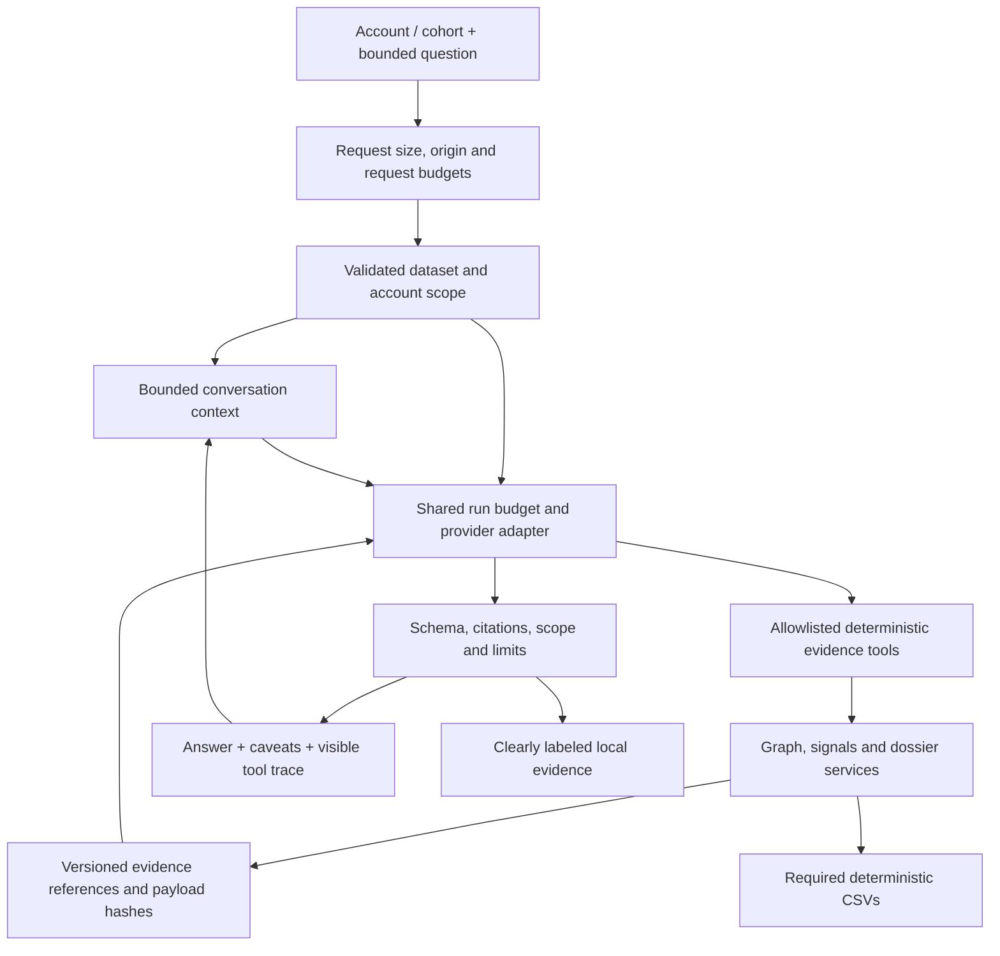

# Freedom Finance architecture and agent hardening review

> Integration note: this is the upstream research record. The current implementation consolidates execution under `copilot/` and app-owned services; the `agent/` imports remain compatible. The shipped UI asks independent scoped questions; session endpoints and browser helpers are tested but retained-history UX is not enabled. Structured numeric claim verification is now implemented. See [current architecture](../architecture.md) and [verification](../architecture-verification.md).

Research and source-code audit: **23 September 2026**. Scope: Freedom Finance only. This report combines a fresh read of the official brief, the current repository, primary technical documentation, and the hardening work undertaken with this review. It supersedes older recommendations where implementation status differs; it does not establish production readiness or financial detection accuracy.

The engineering priority is a reproducible evidence system with useful case continuity. Keep the deterministic graph authoritative, make the assistant a bounded consumer of typed evidence, and put memory, provider execution and security behind explicit module boundaries. LangGraph is the preferred extension when recoverable workflows become necessary. Chroma and Mem0 have useful but different roles; neither is needed to compute or remember transaction facts in this dataset.

## 1. Research method and evidence boundary

The [official Money Graph brief](https://docs.google.com/document/d/1JPLU-G6R25Ge2hVaY2J9cqvrx7FGExj87XKwJPaMz3o/edit) was downloaded again through its public text export and inspected in Russian and Kazakh. The web reader could not open the document, but the direct export succeeded. The downloaded copy remains outside the repository. No organizer account records, credentials or generated private exports were submitted to research tools.

The repository audit read `AGENTS.md`, [methodology](../methodology.md), [architecture](../architecture.md), [acceptance](../acceptance.md), [criteria coverage](../criteria-matrix.md), [validation](../validation.md), the Python engine/API/signals/copilot/audit modules, frontend dependency manifest and relevant tests. Existing research was treated as prior work, with technical decisions rechecked against current primary documentation. The working tree already contained user changes to conversation history and the global assistant; those changes were preserved.

Fresh sources included LangGraph persistence, durable execution and interrupts; LangChain middleware and overview; Mem0 operations and source; Chroma deployment and embedding source; OWASP API/agent/prompt-injection guidance; NetworkX algorithm/backend documentation; Polars streaming; and SQLite WAL. Context7 independently retrieved primary source examples for LangGraph, Mem0 and Chroma. No framework performance or model-quality comparison was run. Package popularity and marketing benchmark claims were not used as correctness evidence.

## 2. Complete track contract

The brief requires one local batch workflow, not a live bank monitoring platform. Its formal acceptance is five mandatory capabilities, eight optional categories, explicit limitations, and reproducible delivery artifacts. The existing [criterion matrix](../criteria-matrix.md) records the detailed feature/test mapping; the table below adds architecture implications.

| Requirement | Repository coverage | Engineering implication / remaining acceptance |
|---|---|---|
| One command, raw Parquet to all three CSVs, under five minutes | CLI and deterministic engine; prior supplied-data clean-process timing recorded | Re-run after engine changes; initial package installation is a separate measurement |
| Role, role score and nonempty evidence for all 2,248 nodes | Nodes inserted before edges; exact export columns; isolated seeds included | Never build the node universe from edges or top-ranked search results |
| Formal, explainable rules for every role | Thresholds, tie order, candidate scores, priority decomposition | Three arbitrary accounts must be explainable from metrics within the demo time |
| Community membership and cluster summaries | Seeded weighted Louvain, stable IDs, size/seed/internal-turnover summaries | Community partition is a hypothesis; never ownership or organizational proof |
| At least twenty ranked nodes plus directed searchable visualization | Ranked export, full paginated entities, bounded React Flow view | Search must reach every input account; clearly disclose omitted graph items |
| Cutoff artifact | `boundary_unknown` documented as permitted vocabulary extension | Depth-four sinks are observation limits; do not call them final beneficiaries |
| Temporal patterns | FIFO overlap, daily spikes, same-day payer groups | Daily evidence cannot resolve ordering within a day or identity of funds |
| Repeated routes / return flows | Bounded repeated A→B→C paths and short cycles | Distinguish structural cycles from examples with increasing transaction dates |
| Anomalies / repeated amounts | Depth-peer and equal-amount motifs | No claim to detect transactions below the collection threshold |
| Resilience | Bounded top-N removal simulation | Structural sensitivity is not an operational intervention forecast |
| Natural-language assistant | Fixed-scope evidence tools, references and offline fallback | Cohort collector question must retain directed path proof and authorized scope |
| Generated account card | JSON/Markdown dossier with observations, hypotheses and requests | Keep deterministic dossier useful without a model subscription |
| Completeness assessment | Seed/boundary/isolate caveats and next-data requests | Missing evidence is explicit; no fabricated completeness percentage |
| Repository, README, outputs, diagram and five-minute live demo | Source, setup, exact contracts, architecture diagram and demo plan exist | Judge launch and live demonstration remain external acceptance activities |
| Describe the approach at roughly one million nodes | Staged scale plan exists | This is a design requirement, not a demand to claim unmeasured million-node support |

Required schemas remain exactly:

- `nodes_roles.csv`: `gid, role, role_score, cluster_id, priority_score, evidence`.
- `clusters.csv`: `cluster_id, n_nodes, n_seed, sum_kzt_internal, top_gids, hypothesis`.
- `top_nodes.csv`: `rank, gid, role, priority_score, why`.

Every evidence string must be nonempty and at most 200 characters. The role vocabulary can be extended when documented, which permits the existing observation-boundary role. The brief's term for role confidence is implemented conservatively as rule fit: there are no labeled outcomes to calibrate probability or claim accuracy.

The rubric allocates 25 points each to workability/task fit, technical implementation, and documentation/reproducibility; practical value receives 15 and development potential/originality 10. A mandatory vector service, model download or cloud dependency would undermine a large share of this rubric. External customer enrichment, invented attributes, hardcoded answer lists, unexplained roles and mandatory paid/GPU infrastructure are excluded by the brief.

The graph contains only outgoing intra-bank transfers during July 2026 above the stated collection threshold and within four hops. Source-only collection makes seed inflows incomplete. Nineteen isolated seeds explain why the complete node-preserving graph has more weak components than the brief's edge-bearing component count. Preserve that distinction rather than deleting isolates to match an aggregate.

## 3. Architecture audit: strengths, defects and seams

The existing shape is appropriate for 2,248 nodes: typed Parquet inputs, Polars preparation, one in-memory NetworkX analysis, read-only FastAPI evidence, and a compiled React workbench. There is no requirement for graph-database operations, distributed ingestion, GPU training, customer identity enrichment or autonomous financial action. The analysis object is a loaded snapshot; replacing data requires a restart.

| Boundary | What is sound | Gap found / recommended ownership |
|---|---|---|
| Input validation | Required columns, nulls, duplicate gids, endpoint membership, finite positive amounts and edge/transaction reconciliation | Endpoint equality admitted float/bool aliases; edge count/depth types were loose; relative amount tolerance contradicted documented absolute tolerance. Fixed in this hardening pass |
| Deterministic scoring | Sorted input, fixed seeds, explicit numerical formulas, isolated-node coverage and cutoff rules | Threshold quality is uncalibrated. Preserve transparent baseline and seek reviewer evidence before changing weights |
| Optional signals | Independent of submitted roles/ranks, bounded paths/cycles, explicit caveats | Cached results are mutable dictionaries; consumers must copy before trimming, and caches must belong to an immutable dataset snapshot |
| Evidence provenance | Canonical input hashes and exact CSV byte hashes | Existing algorithm receipt covers `engine.py`, not all optional signals, provider prompts, lockfiles or the entire deployed build |
| Provider loop | Server-selected scope, empty tool arguments, strict output schema, citation membership, two concurrent calls | Per-call timeout was not a run deadline; real IDs did not validate claims; a fake provider could return tool calls on a tool-disabled round |
| Conversation context | Current working-tree code already admitted bounded untrusted history | UI history is not durable evidence. State requires dataset/algorithm/scope binding, bounded retention and explicit clearing |
| HTTP perimeter | Loopback, trusted host, restricted CORS, response headers, disabled access logs | CORS alone does not prevent a request executing. Add origin/body limits and rate budgets before provider work |
| Browser workbench | Full pagination, inspectable score factors, graph plus exact transfer table, safe Markdown policy | Scope, branch retry and memory reset must remain consistent during asynchronous requests and account navigation |
| Evaluation | Meaningful deterministic edge cases and fake-provider tests | Seven synthetic examples are not a held-out semantic benchmark or a security proof |

Input fixes preserve behavior on valid data: endpoints must be integer values rather than equality-compatible floats/bools; edge transaction counts must be positive integers; edge depth must be a nonnegative integer. Aggregation now uses only the documented 0.01 KZT absolute tolerance. Previously an amount near one billion KZT could admit a 0.50 KZT mismatch through the relative tolerance. Tests cover this magnitude-dependent failure and strict types. No scoring formula or CSV contract changed.

## 4. Modular agent design

Use a small set of domain modules whose contracts survive a later orchestration migration:

The contract module owns request/answer types, constants and scope validation. The evidence module owns allowed tool definitions, compact views, versioned IDs and safe citation targets. The runtime owns provider calls, deadline/accounting, admission and fallbacks. The memory module owns scoped storage, retention, deletion and concurrency semantics. HTTP handlers compose these modules; the model never chooses a storage path, tenant, raw query, URL or executable tool.

These boundaries are implemented in `src/moneygraph/agent/{contracts,evidence,runtime,memory}.py`. The registry now contains eight tools: the original seven views plus `inspect_investigation_brief`, which returns observations, hypotheses, bounded signal examples, limitations and next-data requests in one call. The runtime retains three model rounds/four calls, 2,000 output tokens per round/6,000 total, 24,000 characters per evidence payload and an 80,000-character context accounting budget including replayed provider items. A cooperative 45-second run deadline limits subsequent work and provider timeouts to at most 20 seconds; it cannot forcibly interrupt synchronous work or guarantee provider cancellation. Provider 429s trigger a 30-second cooldown. Final output is bounded before schema parsing.

This is a capability boundary, not merely file organization. Do not put a generic SQL, Python, filesystem or browser tool behind a framework abstraction. A generic tool selected by a capable model still violates the required data boundary.

Each result should identify its dataset and relevant algorithm version, payload hash, evidence kind, selected scope and completeness. Content identity makes stale evidence detectable; it does not authenticate the underlying bank data. Keep amount/count rendering deterministic where possible. A valid citation ID establishes that evidence was retrieved, not that every sentence is supported. Predicate validation for numerical observations, direct-edge claims and increasing-date routes is a separate capability that remains to be implemented beyond citation membership.

## 5. LangGraph and LangChain: adopt for a concrete workflow

[LangGraph persistence](https://docs.langchain.com/oss/python/langgraph/persistence) distinguishes thread checkpoints from stores shared across threads. In-memory checkpoints disappear on restart; its documented SQLite implementation is for local development, while PostgreSQL is the production persistence direction. This fits a future case workflow with explicit stages, resumable analyst review and recovery. A checkpoint identifier must be derived from authorized server state; it is not itself authorization.

[Durable execution](https://docs.langchain.com/oss/python/langgraph/durable-execution) requires deliberate replay design. Put non-deterministic provider operations and side effects in persisted tasks; make retried effects idempotent. Synchronous persistence provides a stronger checkpoint boundary, asynchronous persistence permits a crash window, and exit-only persistence does not protect intermediate progress. Persisted model text can be replayed, but generating it again is not guaranteed to reproduce the wording.

[Interrupts](https://docs.langchain.com/oss/python/langgraph/interrupts) support persisted human review. Resumption restarts relevant node execution; code preceding the interrupt may run again. A review record should bind actor, case version, evidence fingerprint, decision and time. Changing scope or evidence invalidates a prior approval. The current read-only investigation does not require an approval prompt before each evidence read.

[LangChain agents](https://docs.langchain.com/oss/python/langchain/overview) build on LangGraph, so these are complementary abstraction levels. Its [middleware](https://docs.langchain.com/oss/python/langchain/middleware/built-in) includes model/tool limits, retry/fallback, history summarization and human review. Choose individual adapters or middleware when they replace real maintenance work. Avoid stacking independent orchestration loops, retries and history stores that disagree about scope and budget.

| Choice | Decision | Adoption gate |
|---|---|---|
| Current bounded Responses adapter | Retain and modularize | All authority, memory and budgets enforced outside the model |
| LangGraph | Preferred next workflow runtime, not required for this release | Demonstrated restart/resume, state-version migration, replay and scope tests |
| LangChain | Optional provider/middleware components | A named capability simplifies existing code without widening tools |
| Multi-model investigator committees | Defer | Measured improvement on held-out evidence questions within shared latency/cost limits |
| Deterministic specialist functions | Use | Independently compute topology, temporal patterns and coverage with one evidence contract |

For a future graph, begin with `validate → load_scope → collect_evidence → draft → verify → present`. Add a review interrupt only for a real analyst decision. A multi-agent interface animation is not evidence of additional analytical capability.

## 6. Memory: separate conversation, evidence and decisions

The local implementation uses process memory by default with an explicitly configured SQLite option. Memory contains bounded conversational context, never authoritative role assignments or financial facts. Its key binds dataset identity, analysis version and selected account/cohort; a conversation identifier alone cannot substitute for that binding. Bound both message count and total text, expire sessions, cap session count and expose deletion. Reject or reset changed-scope sessions rather than silently mixing accounts. The current expiry is 24 hours from session creation, not a sliding inactivity timeout; retained history is capped at six messages and 12,000 characters across 128 sessions.

The implemented client first creates an empty server session through `POST /api/copilot/sessions`, obtaining its random capability before sending question text. Session leases reject overlapping requests. Deletion, expiry or a newer revision prevents late work from recreating removed context. The UI resets context for edited/retried branches and removes context on cancellation; deletion failure remains retryable. Tokens stay outside exported transcripts and browser persistence. This is bounded conversation storage, not LangGraph checkpointing or authenticated case ownership. Expiry is checked during store operations; no timed physical-erasure guarantee is made.

| Memory category | Authoritative owner | Policy |
|---|---|---|
| Transaction/graph facts | Immutable analysis snapshot and provenance | Recompute/retrieve for every answer; never recover a number from chat |
| Recent conversation | Scoped context store | Untrusted text for follow-up interpretation; explicit TTL and size limits |
| Analyst case notes | Future typed case records | Author, time, scope, evidence reference and review status |
| Reviewed disposition | Future case database/audit trail | Human-authored decision; never silently promoted from a model answer |
| Display/language preference | Future explicit preference store | User-approved, editable, removable; unrelated to financial truth |
| Retrieval documents | Versioned authorized corpus | Source revisions, chunk identities, access control and injection handling |

SQLite WAL permits readers alongside a writer but still has a single writer and associated checkpoint behavior. It is suitable for a bounded local store; it is not a substitute for shared-service concurrency design. Memory files, WAL/SHM companions and backups must remain private and ignored by Git. Deletion from the active application store must not be described as secure erasure of backups or storage media. [SQLite WAL](https://www.sqlite.org/wal.html).

Branch edits and regenerate are especially important: a rewritten question should not inherit the superseded assistant reply as fact. The UI must provide the active branch or reset server context appropriately. If the browser aborts waiting, a server run may still finish; do not claim cancellation of paid work without a real server cancellation protocol.

### Mem0 decision

Mem0's [add operation](https://docs.mem0.ai/core-concepts/memory-operations/add) normally extracts memories through a model. `infer=False` stores raw content, and mixing inferred/raw writes can duplicate a fact. Its entity-partitioning guidance emphasizes scoping, but application authorization still has to choose and constrain the identifiers. In this product, automatic extraction could preserve an unsupported accusation or compress away a boundary caveat. That is a poor default for transaction evidence.

Keep Mem0 optional for approved language/display preferences if semantic preference recall later proves useful. Do not enable model-controlled financial-memory writes, automatic cross-case recall or generic memory MCP tools. Plain typed records are sufficient for a small preference set. Self-hosting the [open-source SDK](https://docs.mem0.ai/open-source/overview) does not mean every configured embedding/LLM provider is local; inspect those configurations. Its [deletion operations](https://docs.mem0.ai/core-concepts/memory-operations/delete) must be included in a complete retention inventory if adopted.

### Chroma decision

Chroma is a document/embedding retrieval system. Its [architecture](https://docs.trychroma.com/reference/architecture/overview) offers local, server and distributed modes; the deployment choice follows corpus and service requirements. Similarity ranking cannot calculate exact totals, infer missing edges or prove directed reachability. It should not replace the graph tool layer.

The default embedding function uses local `all-MiniLM-L6-v2` and downloads model files automatically, verified in the [official embedding source](https://github.com/chroma-core/chroma/blob/main/chromadb/utils/embedding_functions/onnx_mini_lm_l6_v2.py). Consequently, a fresh offline machine may fail despite the database being local. Pre-provision an approved embedding model or supply embeddings explicitly before claiming offline retrieval. The [client guide](https://docs.trychroma.com/docs/run-chroma/clients) distinguishes persistent local storage from server clients.

The current methodology and brief are a tiny corpus. Start with bounded exact section lookup or lexical retrieval. Add Chroma only after a retrieval evaluation demonstrates an advantage. If introduced, every chunk needs source/hash/section/version metadata; server-side scope filtering is mandatory, and retrieved text remains untrusted. Vector dimensions and similarity scores are not calibrated confidence. If a future shared product already uses PostgreSQL, compare a vector extension before operating a second datastore.

## 7. Security and rate limits

The threat model is concrete: hostile questions or history, poisoned future notes/documents, malformed provider calls, oversized bodies, repeated paid requests, stale/cross-scope sessions, sensitive trace leakage, and misleading financial claims. The model is not trusted to enforce any of these boundaries.

OWASP's [agent security guidance](https://cheatsheetseries.owasp.org/cheatsheets/AI_Agent_Security_Cheat_Sheet.html) recommends least-privilege tools, memory isolation, explicit resource limits and adversarial tests. Its [prompt-injection guidance](https://cheatsheetseries.owasp.org/cheatsheets/LLM_Prompt_Injection_Prevention_Cheat_Sheet.html) supports separating untrusted content from instructions and validating outputs. These are layered controls, not a guarantee that injection disappears. Prompt text cannot authorize tools or externalize financial records.

| Control | Purpose | Boundary to disclose |
|---|---|---|
| Host/origin validation and loopback default | Reduce browser-driven access to a local paid service | Not identity or multi-tenant authorization |
| Body cap before parsing, field/array limits | Bound request memory and parsing cost | A reverse proxy/service still needs connection/time/resource limits |
| Per-client and aggregate copilot request budgets | Prevent sequential cost abuse in addition to concurrent saturation | Process-local budgets reset on restart and do not coordinate workers |
| Two active provider runs | Protect local capacity | Concurrency alone does not limit requests per minute or daily spend |
| Shared deadline, call/token/context limits | Bound a complete investigation | Synchronous work needs its own finite bounds; timeout is not remote cancellation |
| Tool allowlist and fixed scope | Prevent model-selected records/actions | Framework installation does not expand authority |
| Typed output, evidence hashes and citation validation | Reject malformed/stale/unknown references | Does not establish prose entailment |
| Safe trace metadata | Show tool/status/timing without secrets | Raw prompts, account records and provider exceptions stay out of routine logs |
| TTL/session cap/delete | Bound retained conversational data | Does not imply encrypted storage, authenticated users or media erasure |

OWASP [API resource-consumption guidance](https://api-security.owasp.org/editions/2023/en/0xa4-unrestricted-resource-consumption/) treats request frequency, payload size, operation count, execution time and provider spending as separate limits. Use a strict budget for paid endpoints, return an actionable retry interval, and keep deterministic evidence usable during saturation. Proxy forwarding headers must not become client identity unless a trusted proxy is explicitly configured. Shared deployments require atomic distributed accounting by authenticated user/case plus provider-side cost controls.

Retry policy must share the same deadline and count against the same call budget. Do not automatically retry authorization failures, invalid tool arguments or invalid citations. Treat provider quota/unavailability as a safe local-fallback condition. New memory/retrieval adapters need their own bounded I/O and failure behavior; they must not make the offline core fail.

## 8. Other system improvements and meaningful differentiators

The strongest additions shorten verification work for the analyst and judge:

| Capability | Value | Current status / next proof |
|---|---|---|
| Full score decomposition | Explain why an arbitrary account is prioritized | Implemented; retain contribution reconciliation tests |
| Directed cohort-to-collector proof | Answer the brief's five-account question with actual paths | Implemented bounded computation; improve citation target navigation where needed |
| Boundary-aware next-evidence requests | Convert uncertainty into concrete follow-up work | Implemented deterministic dossier; domain usefulness still needs review |
| Dataset-bound conversation memory | Maintain follow-up context without treating chat as evidence | Implemented with bounded process/SQLite storage, session precreation and reset/delete handling; final browser verification remains in the validation record |
| Versioned evidence receipts | Identify exactly which evidence supported an answer | Agent evidence identity includes dataset, engine, signals and agent-module source; dependency/build provenance is future work |
| Typed numerical observations | Render verified amounts/counts alongside interpretation | Planned; evidence membership alone is insufficient |
| Reproducible case capsule | Package reviewed notes, hypotheses and evidence manifest | Planned; do not modify the three mandatory CSV contracts |
| Evidence-change comparison | Show what changed when a new authorized snapshot arrives | Planned; requires explicit snapshot identity and no hidden live ingestion |
| Review-effort experiment | Compare priority queue usefulness to volume/degree baselines | Planned; blind reviewer assessment before performance claims |

Frontend work should preserve a single mounted assistant runtime, explicit selected scope, real mode/status, visible references and tool traces, active-branch semantics, and honest memory/reset wording. Keep generated links inert and HTML/images disabled unless a separate safe content policy is implemented. Graph direction and exact tables matter more than rendering all nodes simultaneously. Accessibility acceptance includes keyboard scope selection, focus restoration, readable mobile dialogs, reduced motion and non-color-only role labels.

The pipeline remains a snapshot job. For larger inputs, Polars [streaming](https://docs.pola.rs/user-guide/concepts/streaming/) can process supported lazy operations in batches; unsupported operations may fall back, so inspect query plans and measure peak memory. Avoid claiming that reading Parquet automatically makes the whole graph algorithm streaming.

At roughly one million nodes: partition/validate aggregates, precompute versioned features and communities offline, build indexed bounded-neighborhood serving, and keep frontend payloads small. Benchmark alternative graph engines against identical contracts, including isolated nodes, direction, self-loops, centrality normalization and deterministic exports. NetworkX [backend dispatch](https://networkx.org/documentation/stable/reference/backends.html) can convert graph representations and has algorithm-specific support; it is not a transparent speed guarantee. Its [betweenness documentation](https://networkx.org/documentation/stable/reference/algorithms/generated/networkx.algorithms.centrality.betweenness_centrality.html) exposes sampled estimation through `k`; compare ranking stability across sample counts before selecting a large-graph budget.

Do not add Redis, a queue, graph database, object store or observability cluster solely for an architecture diagram. Add each when its concrete ownership requirement exists: multiple analysts, durable jobs, incremental snapshots, corpus retrieval or operational monitoring. Keep dependency locks and a clean synthetic launch as the baseline throughout.

## 9. Delivered scope versus remaining work

This review's implementation scope is deliberately narrower than the future architecture. Verify final merged behavior with the release checks; the status below distinguishes work targeted in this change set from proposed product extensions.

| Priority | Item | Status in this change set |
|---|---|---|
| P0 | Strict endpoint/count/depth validation and absolute aggregation tolerance | Implemented; focused engine suite: 26 passing tests |
| P0 | Preserve deterministic roles, every node, exact CSVs and offline launch | Existing invariant; full regression/export check remains the integration gate |
| P0 | Separate contracts, eight evidence tools, execution and memory | Implemented; inspect final module/test results |
| P0 | Cooperative run budget, bounded provider timeout/context, reject disabled tools | Implemented with fake-provider adversarial tests; no hard wall-clock cancellation guarantee |
| P0 | HTTP body/origin guard and copilot rate budgets | Implemented with framing, foreign-origin, retry and forwarding-header tests; process-local only |
| P1 | Process-default / opt-in SQLite bounded conversation memory | Implemented with scope, expiry and deletion tests; local, unauthenticated deployment boundary remains |
| P1 | Frontend scoped memory, precreation handshake and branch/reset integration | Implemented; final browser verification belongs in the validation record |
| P1 | Dataset/algorithm/payload evidence identity | Implemented; not a full supply-chain or authenticity receipt |
| P1 | LangGraph recoverable review workflow | Planned, not installed merely to satisfy a technology list |
| P1 | Typed claim/value verification and broader held-out evaluation | Planned; current schema/citation checks do not prove every sentence |
| P2 | Chroma retrieval and Mem0 preferences | Evaluated and deferred pending corpus/preference need and offline/security tests |
| P2 | Authenticated multi-user cases, distributed rate limits, full retention inventory | Planned production boundary; do not expose local private-data service publicly |
| P2 | Million-node implementation and measured performance | Design only, as permitted by the brief |

Implementation presence does not establish acceptance by itself. [Validation](../validation.md) records the final test/build results and a fresh offline supplied-data export in 0.9401 seconds, retaining all 2,248 nodes, 19 isolates and 444 observation boundaries. This measures a clean process on this host with installed dependencies, not initial installation or independent machine provisioning.

## 10. Verification and next release gates

Run backend tests and the frontend production build after integration. Preserve exact output schema/order and input-order determinism; repeat the supplied-data export without copying records into logs. Check a clean synthetic launch with no credentials, memory path or external AI enabled. Generated artifacts and database sidecars must remain ignored.

The meaningful agent/security regression suite should cover:

1. Unknown or nonempty-argument tools; a tool returned despite a tool-disabled round; excessive call/context budgets; malformed or repeated citation IDs.
2. A valid citation attached to an invented number, reversed edge, unsupported date ordering or ultimate-beneficiary assertion. These require future typed predicates or human semantic review, not just schema checks.
3. History containing fake system instructions, old citations, invented facts, another account, and branch-superseded answers. Fresh evidence remains necessary.
4. Changed dataset/algorithm/cohort, guessed or stale session IDs, TTL expiry, concurrent appends, storage failure, delete followed by retrieval, SQLite restart, and private file placement.
5. Provider timeout/quota/error, repeated requests, concurrent saturation, forged forwarding headers, oversized or chunked bodies, foreign origins, and cleanup failure.
6. Boundary nodes, isolated seeds, no-flow accounts, seed ratios, self-transfers, all-zero degree cohorts, and bounded-search truncation.

Create at least 24 independently specified synthetic questions before tuning, reserving an untouched subset. Measure exact-value agreement, citation relevance, boundary caveat recall, unsupported-claim rate, fallback rate, final-answer latency and token/tool counts. A model judge may flag interpretation problems but cannot be the authority for arithmetic or access control. Add domain-expert usefulness and time-to-verify evaluation when available. None of these measurements creates crime labels or supports fraud precision/recall on the unlabeled supplied data.

The next framework milestone should be a real restart/resume demonstration with stale-scope rejection. The next retrieval milestone should be measured section-retrieval improvement on an authorized corpus. The next memory milestone should be explicit reviewed case records. Those capabilities are more defensible than accumulating frameworks without validated analyst benefit.
