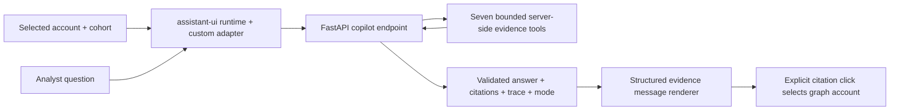

# EvidenceGraph UI: current libraries, Square templates and assistant architecture

Research date: **23 September 2026**. The target is the existing React 19 / Vite / FastAPI Money Graph investigation workspace. Base UI and assistant-ui are user-required choices. This report evaluates how to use them well, identifies reusable patterns, and separates working libraries from presentation-only templates.

## Recommendation

Use **Base UI 1.8.0 for product interactions**, **assistant-ui 0.15.21 for the evidence assistant**, and retain **Cytoscape.js for the directed graph**. Keep Vite and the current FastAPI contract. **Square Emails is the best interaction-layout reference** for its persistent queue and selected-item detail workspace; pair that pattern with **Dashboard 2's restrained navigation, framed workspace and table rhythm**. Compose both ideas independently around our queue → graph → evidence workflow. Dashboard 4 is a secondary reference for a compact analytical summary. Generic overview charts should not displace the investigation canvas.

Square is useful for layout ideas, but its current **custom license is not MIT**. Its Chat template also does **not** implement a working AI backend: source inspection found a hardcoded first greeting, then user-message appends. assistant-ui is the actual off-the-shelf conversational UI/runtime component. [Square repository](https://github.com/zerostaticthemes/square-ui), [Square license](https://github.com/zerostaticthemes/square-ui/blob/8985cb634cc10d57988a187441ae9c971ed890ed/LICENSE.md), [Chat source](https://github.com/zerostaticthemes/square-ui/blob/8985cb634cc10d57988a187441ae9c971ed890ed/templates-baseui/chat/components/chat/chat-main.tsx).

## Research method and freshness

Four Exa searches requested **26 result slots**; three direct-fetch calls requested **13 official pages**. Some fetched pages contained little content, so source/package inspection supplied missing detail. Technical conclusions rely on maintainer documentation, live GitHub REST metadata, actual repository files and the npm registry. No comparative UI performance benchmark or accessibility certification was performed.

GitHub values below were read at **10:20–10:21 UTC on 2026-09-23**. HEAD dates are the actual default-branch commit timestamps, not `pushed_at`. “Recent” means since **2026-08-24**, calculated as research date minus 30 days. Stars indicate adoption, not accessibility quality, security or fitness for financial investigation. Exact commit links preserve the metadata snapshot.

| Repository | Stars | Default HEAD (UTC) | License | Decision |
|---|---:|---|---|---|
| [shadcn/ui](https://github.com/shadcn-ui/ui) | 124,457 | [2026-09-21](https://github.com/shadcn-ui/ui/commit/98a1fe67b439324ddc857f47fbdce056600a4329) | MIT | Reference/component distribution layer; select only needed Base UI components |
| [Ant Design](https://github.com/ant-design/ant-design) | 99,589 | [2026-09-22](https://github.com/ant-design/ant-design/commit/230af2a36430609a5164569522bfd0065dd0c059) | MIT | Strong complete enterprise kit; unnecessary second visual system here |
| [React Flow / xyflow](https://github.com/xyflow/xyflow) | 38,477 | [2026-09-01](https://github.com/xyflow/xyflow/commit/0a1f9575b25679f2880175de8d3eae21aedde921) | MIT | Workflow/node-editor reference; not a reason to replace the transaction graph |
| [Mantine](https://github.com/mantinedev/mantine) | 31,752 | [2026-09-23](https://github.com/mantinedev/mantine/commit/e6d303e664fd0fc2372eab2bb64e647a77a5b321) | MIT | Fast complete app kit, but overlaps Base UI and existing styling |
| [TanStack Table](https://github.com/TanStack/table) | 28,447 | [2026-09-16](https://github.com/TanStack/table/commit/21d713fc4947d2a08cc2136bb055889a61412ded) | MIT | Add only for multi-column sorting/filtering/selection complexity |
| [Recharts](https://github.com/recharts/recharts) | 27,583 | [2026-09-22](https://github.com/recharts/recharts/commit/89f2648a98665630cfc378f4bc8fb4eafd860788) | MIT | Suitable for richer daily-flow comparison; optional at current scale |
| [Radix Primitives](https://github.com/radix-ui/primitives) | 19,319 | [2026-07-31](https://github.com/radix-ui/primitives/commit/f7ecd5ab16f5e1e820eb5786a1419a98a2d594ae) | MIT | Mature alternative; no direct product adoption required |
| [React Spectrum / React Aria](https://github.com/adobe/react-spectrum) | 15,887 | [2026-09-22](https://github.com/adobe/react-spectrum/commit/f1cee837470dbb95fa8d7fcd931f32ff69ebdfbf) | Apache-2.0 | Strong accessibility/internationalization alternative; repository count includes multiple packages |
| [assistant-ui](https://github.com/assistant-ui/assistant-ui) | 12,274 | [2026-09-23](https://github.com/assistant-ui/assistant-ui/commit/c84c7c6f7dec5fdfa111bd00bf42a6edd89b4964) | MIT | Use for copilot state, composer, messages and accessible interaction |
| [Cytoscape.js](https://github.com/cytoscape/cytoscape.js) | 11,221 | [2026-09-07](https://github.com/cytoscape/cytoscape.js/commit/7ba634095d8954089ee5dc09ada0030f2dca134c) | MIT | Retain for directed graph investigation |
| [Base UI](https://github.com/mui/base-ui) | 10,975 | [2026-09-23](https://github.com/mui/base-ui/commit/9d150e4cf23809455870d5bc467271aafc5679f5) | MIT | Use for accessible unstyled product primitives |
| [TanStack Virtual](https://github.com/TanStack/virtual) | 7,119 | [2026-09-14](https://github.com/TanStack/virtual/commit/78371e851e90fd74e984deeb0c3fd8098e2cd4f3) | MIT | Use only after a large list is measured as a rendering bottleneck |
| [Square UI](https://github.com/zerostaticthemes/square-ui) | 6,121 | [2026-09-15](https://github.com/zerostaticthemes/square-ui/commit/8985cb634cc10d57988a187441ae9c971ed890ed) | Custom ln-dev UI License | Layout reference; independent implementation |
| [react-force-graph](https://github.com/vasturiano/react-force-graph) | 3,303 | [2026-02-04](https://github.com/vasturiano/react-force-graph/commit/48b84724820813733080717520b3ac6b4deadc90) | MIT | Optional 3D research view only if it answers a real spatial/temporal question |

All fourteen repositories reported `archived: false`. Radix and react-force-graph did not have a HEAD commit within the preceding 30 days; that is not by itself evidence of abandonment. Metadata was read through authenticated `gh api repos/{owner}/{repo}` and `commits?sha={default_branch}&per_page=1`; no credentials were printed or persisted.

## Package versions: actual registry, not old template pins

| Package | npm latest at research | Published | Compatibility observation |
|---|---|---|---|
| `@base-ui/react` | **1.8.0** | 2026-09-04 | React 17/18/19 peers; `date-fns` and `@date-fns/tz` peers are optional |
| `@assistant-ui/react` | **0.15.21** | 2026-09-18 | React 18/19 peers; current repository source matches this version |
| `@assistant-ui/react-markdown` | **0.14.16** | 2026-09-18 | Optional; requires assistant-ui ^0.15 and React 18/19 |
| `react-aria-components` | **1.21.1** | 2026-09-04 | React 19-compatible peer range |
| `@mantine/core` | **9.6.2** | 2026-09-21 | Requires React/ReactDOM ^19.2 and matching Mantine hooks |
| `antd` | **6.6.5** | 2026-09-20 | React/ReactDOM >=18 |
| `recharts` | **3.10.1** | 2026-07-25 | React 19-compatible; Node >=18; match `react-is` peer |
| `@tanstack/react-table` | **9.2.4** | 2026-08-28 | React >=18; Node >=20; do not copy v8 examples without checking APIs |
| `@tanstack/react-virtual` | **3.14.13** | 2026-09-14 | React 19-compatible |

Source: live [npm registry](https://registry.npmjs.org/), specifically each package's `dist-tags.latest`, matching `versions` entry and publish timestamp. These are research snapshots, not instructions to upgrade unrelated dependencies. Pin the selected versions and verify the installed lockfile/production build.

The current assistant-ui package itself depends on `radix-ui`, alongside its core/store packages, Zustand and other supporting packages. Using Base UI for our product controls does **not** make the entire bundle Radix-free. That transitive dependency is compatible with the requested architecture; rewriting assistant-ui internals would create unnecessary maintenance. The included `assistant-cloud` package does not make a hosted account necessary for `LocalRuntime`; do not initialize cloud adapters for this local evidence app. [Inspected package manifest](https://github.com/assistant-ui/assistant-ui/blob/c84c7c6f7dec5fdfa111bd00bf42a6edd89b4964/packages/react/package.json).

## Square UI: source inspection and concrete reuse decision

The repository has separate `templates/` Radix and `templates-baseui/` Base UI implementations. The free template collection and linked paid Pro products are different offerings. The inspected immutable revision is `8985cb634cc10d57988a187441ae9c971ed890ed`.

| Template | Source-defined layout/content | Good reference for EvidenceGraph | Do not transplant |
|---|---|---|---|
| [Emails, Base UI](https://github.com/zerostaticthemes/square-ui/tree/8985cb634cc10d57988a187441ae9c971ed890ed/templates-baseui/emails) | Persistent sidebar/header; fixed 320 px desktop list beside flexible detail; mobile detail drawer and navigation sheet | **Best interaction layout:** a queue remains visible while the selected account's graph and evidence change; mobile disclosure avoids compressed desktop columns | Email actions/content; clearing account selection just because a mobile drawer closes; fixed template dimensions without testing |
| [Dashboard 2, Base UI](https://github.com/zerostaticthemes/square-ui/tree/8985cb634cc10d57988a187441ae9c971ed890ed/templates-baseui/dashboard-2) | Off-canvas sidebar; framed full-height content; sticky header; welcome/stats; source/revenue charts; deals table | **Best overall shell reference:** compact global navigation, clear content boundary, dense list/table controls, local scroll regions | CRM branding, generic greeting, fake team/user controls, redundant overview charts, Next.js routing |
| [Dashboard 4, Base UI](https://github.com/zerostaticthemes/square-ui/tree/8985cb634cc10d57988a187441ae9c971ed890ed/templates-baseui/dashboard-4) | Same shell; stats; leads chart next to top performers; leads table | Ranked shortlist alongside a graph/metric summary; compact evidence summaries | “Top performers” success framing is inappropriate for heuristic account priority |
| [Dashboard 5, Base UI](https://github.com/zerostaticthemes/square-ui/tree/8985cb634cc10d57988a187441ae9c971ed890ed/templates-baseui/dashboard-5) | Welcome, export/new actions, stats, two-column tasks/performance region and projects table | Strong primary action placement and responsive content grouping | Task-manager semantics and invented productivity KPIs |
| [Chat, Base UI](https://github.com/zerostaticthemes/square-ui/tree/8985cb634cc10d57988a187441ae9c971ed890ed/templates-baseui/chat) | Conversation sidebar, mobile sheet, welcome/conversation states and composer | Space allocation and mobile sidebar concept | Mock model selector, hardcoded greeting, fake assistant behavior, replacement of assistant-ui with a hand-built chat |

Inspected files include `README.md`, `LICENSE.md`, Dashboard 2/4 `package.json`, `app/page.tsx` and content components; Dashboard 2 header/sidebar; Dashboard 5 content; Chat package/page/`chat-main.tsx`; and Emails page/package. Dashboard 2 and 4 both declare **Next 16.2.6, React 19.2.1, Base UI ^1.0.0, Tailwind 4, Recharts ^2.15.4 and Zustand 5**. Chat declares React 19.2.3 and Base UI ^1.5.0, with no assistant-ui dependency. Emails uses the same Next/React generation and includes both Base UI and Radix. Several server/tooling packages in the manifests are irrelevant to our layout; copying the whole manifest would enlarge the dependency surface without product value. [Dashboard 2 manifest](https://github.com/zerostaticthemes/square-ui/blob/8985cb634cc10d57988a187441ae9c971ed890ed/templates-baseui/dashboard-2/package.json), [Dashboard 4 manifest](https://github.com/zerostaticthemes/square-ui/blob/8985cb634cc10d57988a187441ae9c971ed890ed/templates-baseui/dashboard-4/package.json), [Emails composition](https://github.com/zerostaticthemes/square-ui/blob/8985cb634cc10d57988a187441ae9c971ed890ed/templates-baseui/emails/app/page.tsx).

**License decision:** the current license allows integrated personal/commercial end products, but also prohibits redistribution of components/templates as standalone resources, competing template products, and making components/templates available in repositories. Those terms are not the same as the README's broad “open-source” wording. Because this hackathon uses a reviewable source repository and organizer redistribution rights, the implementation decision is to reproduce the *layout principles with original code* and use MIT Base UI/assistant-ui components, rather than copy Square's template source. No purchase, permission request or project delay is needed to use general layout ideas. This is an engineering reuse decision; it is not a blanket interpretation of every possible licensed use. [License text](https://github.com/zerostaticthemes/square-ui/blob/8985cb634cc10d57988a187441ae9c971ed890ed/LICENSE.md).

The exact repository restriction appears under “You are NOT allowed to”: “Make the Components or Templates available in any repository, marketplace, or website (free or paid)”. The same document defines an end product as an integrated application where the components are not the primary redistributed value. The relationship between those clauses is not resolved here; this report does **not** claim all repositories containing an end product are categorically forbidden. Independent implementation avoids depending on that interpretation.

## Base UI versus the alternatives

| Choice | Strength | Tradeoff | Decision for this app |
|---|---|---|---|
| **Base UI** | Unstyled primitives with keyboard/focus/pointer behavior; normal CSS or Tailwind; one tree-shakable package | We still own visual tokens, accessible labels, contrast, visible focus and composition | **Use.** Good fit for a distinctive evidence workbench, already required by user |
| **Radix Primitives** | Mature headless component set and established composition patterns | Different APIs/state selectors; a second direct primitive system adds migration work | Retain where required internally by assistant-ui; do not migrate healthy third-party internals |
| **shadcn/ui** | Source-owned styled components and registry tooling; accelerates a coherent starting point | It is a distribution approach, not one immutable runtime library; selected source and underlying base matter | Optional Base UI component source/reference; install only needed pieces, not a whole template |
| **React Aria Components** | Strong unstyled accessibility and internationalization foundation; rich collection/table interactions | Another complete primitive layer to learn/style; unnecessary alongside mandated Base UI | Best alternative if complex accessible data collections/localized date entry become dominant |
| **Mantine** | Complete styled components, AppShell, forms, dates, notifications and Vite setup | Adds its visual/provider conventions and overlaps controls we already own | Strong greenfield back-office option; not useful to install alongside Base UI here |
| **Ant Design 6** | Extensive enterprise components, tables/forms, theming and internationalization | Opinionated enterprise appearance and another design system to maintain | Best if the product were primarily large CRUD forms/tables; graph evidence workflow favors custom Base UI composition |

Primary references: [Base UI quick start](https://base-ui.com/react/overview/quick-start), [accessibility responsibilities](https://base-ui.com/react/overview/accessibility), [Radix introduction](https://www.radix-ui.com/primitives/docs/overview/introduction), [React Aria](https://react-aria.adobe.com/), [Mantine Vite](https://mantine.dev/guides/vite/), [Ant Design 6](https://ant.design/docs/react/introduce).

The latest shadcn position matters: **Base UI became the default for new projects in July 2026**; Radix remains supported, and existing applications are not required to migrate. React Aria also became a first-class shadcn component base in July. Therefore “shadcn equals Radix” is now an outdated assumption. The July Base UI announcement mentions version 1.6.0; the live September npm version is 1.8.0. [Base UI announcement](https://ui.shadcn.com/docs/changelog/2026-07-base-ui-default), [React Aria announcement](https://ui.shadcn.com/docs/changelog/2026-07-react-aria).

### Product controls to implement with Base UI

- Dialog/Popover/Menu for export actions, data limitations and contextual actions, with reliable dismissal/focus return.
- Tabs for evidence versus assistant, and accessible selected-state navigation for investigation views.
- Select/Combobox for roles and account search where the interaction needs more than a native control; do not replace a simple native input just for branding.
- Tooltip for concise icon labels, while preserving visible labels for critical actions.
- Collapsible sections for score explanations and provenance, with real buttons and keyboard behavior.

Follow Base UI's documented root `isolation: isolate` guidance so portaled controls layer predictably above the graph and inspector. Do not solve every overlay with ever-larger z-index values. Keyboard support still needs integration checks: Tab sequence, Escape, arrow navigation, initial/final focus, accessible names and visible focus outlines. The library does not guarantee the accessibility of arbitrary custom markup around it.

## assistant-ui runtime and security fit

**Preferred small integration: `LocalRuntime` with a custom `ChatModelAdapter`.** Its one `run` method calls the existing FastAPI copilot endpoint, forwarding the AbortSignal. assistant-ui manages the message/composer state; the backend remains the sole authority for model calls, tools, limits and evidence validation. It does not require an AI SDK migration, Next.js server, browser OpenAI client or cloud account. The documentation's Next.js example is a scaffold example, not a framework constraint. [LocalRuntime](https://www.assistant-ui.com/docs/runtimes/custom/local-runtime), [runtime architecture](https://www.assistant-ui.com/docs/runtimes/concepts/architecture).

**Alternative: `ExternalStoreRuntime`** if preserving the application's own typed response/message store is simpler for structured evidence rendering. Supply `messages`, `isRunning`, `onNew`, `onCancel` and a converter. Its capabilities are callback-driven: do not enable editing, regeneration, branching, queueing or client-side tool results unless their backend semantics are actually implemented. Both choices are valid; use one runtime, not two. [ExternalStoreRuntime](https://www.assistant-ui.com/docs/runtimes/custom/external-store).

The current backend accepts a question with selected `gid`/cohort, not arbitrary full conversation history. A UI thread must not imply that the model remembers earlier turns. Until history is deliberately supported, treat each submission as an independent evidence question and label its scope. Reset/remount or deliberately isolate runtime state when the selected account/cohort changes, and abort stale requests so an old response cannot appear under a new account.

Render the structured response as **evidence, hypothesis, missing evidence, citations and tool trace**. Preserve offline/AI mode labels and fallback reasons. Citation chips should select only IDs validated by the backend and known to the current data. Show tool progress only from real events; a JSON endpoint can show a truthful busy state and completed trace without fabricated token streaming.

Do **not** register general client `execute` tools to obtain richer chat cards. assistant-ui's generative/tool UI is a rendering capability; server tools remain fixed, read-only and budgeted. Do not allow model output to become arbitrary HTML, JavaScript, URLs to fetch, or JSON-driven components from an unrestricted registry. Prefer explicit React renderers for the trusted response schema. Markdown is optional; omit raw HTML rendering and remote image embedding in private evidence views. [Tool UI documentation](https://www.assistant-ui.com/docs/guides/tool-ui).

Attachments, voice, cloud history, model selection and long-running sessions are available in the ecosystem, but none should appear as nonfunctional buttons. A model picker must select from server-authorized options and expose actual behavior; a frontend dropdown must never imply it changes the deterministic role engine. The custom assistant UI should make the existing bounded agent easier to inspect, not expand its powers.

## Graph, charts and tables

**Keep the primary graph two-dimensional and directed.** Cytoscape provides the graph interaction, selection/style/layout capabilities we need; it is already integrated. Selected paths, direction arrowheads, depth-four boundaries, neighborhood truncation and exact edge values are central to explaining the answer. This is more valuable than adding a new renderer for visual novelty. [Cytoscape documentation](https://js.cytoscape.org/).

`react-force-graph` supplies 2D/3D/WebGL-oriented graph experiences, but a third visual axis should encode something meaningful. A possible future view is an explicitly labeled depth/time axis with a synchronized 2D selection and textual evidence. Without that task, perspective, occlusion and motion can make exact paths harder to follow; this is a design judgment, not a measured benchmark. Do not imply an arbitrary 3D position is a real geographical or financial coordinate. Keep any 3D view optional, lazy-loaded and secondary to the accessible evidence table. [react-force-graph](https://github.com/vasturiano/react-force-graph).

React Flow is appropriate for an agent workflow editor or trace diagram, but changing the transaction graph to an editable node-flow canvas does not solve a current need. A list of completed server tool calls is sufficient for a short bounded run.

For the 31-day flow timeline, accessible bars remain a reasonable baseline. The upgraded app fills calendar dates with no observed transfers for windows up to 366 days and discloses gaps for longer windows. Zero shown on an unobserved-activity date means zero in the supplied records, not proof of zero activity across the bank. Use Recharts 3 if interactive comparison, shared tooltips, brush/zoom or several coordinated series become necessary. Square's Recharts 2 manifest is not a latest-version recommendation. Always expose exact KZT values and dates in text/table form; a chart is not the sole evidence surface.

TanStack Table becomes useful for sortable multi-column account tables and controlled row selection. At the current bounded queue size, it is not mandatory. TanStack Virtual is useful after actual list-rendering measurements justify it; it adds focus, row-height and screen-reader considerations. Avoid introducing both simply because their star counts are high.

## Concrete dashboard composition

Use one compact product navigation rail, a **ranked account queue**, a **flexible central graph/signal workspace**, and a **contextual evidence/assistant inspector**. Keep a single top context bar with observation period, dataset mode and export entry point. The central view should stay visually dominant; top-level “KPI cards” should contain only useful coverage facts, not filler revenue or productivity metrics.

Desktop example: 56–64 px navigation, approximately 260–280 px queue, fluid graph, approximately 360–400 px inspector. Treat these as design starting points, not fixed constraints; collapse the inspector to a sheet when the central graph becomes too narrow. On small screens, use explicit Queue / Network / Evidence views rather than four simultaneously compressed columns. Preserve selection and cohort state while switching views.

Use the existing restrained ink/forest palette, clear borders, tabular numeric typography and distinct but accessible role colors. Keep heuristic priority visually different from proof or adjudication: avoid alarm-red “fraud score” badges, success language such as “top offenders,” and animations implying actual live transactions. Display “observation boundary” and “evidence missing” with text, not color alone.

### Acceptance checks for this UI upgrade

1. A judge can search an arbitrary account, select it, follow a directed neighbor/path and read the role's numeric explanation without opening the assistant.
2. Role/cluster filters, cohort selection, all investigation views and the three required exports remain reachable.
3. The assistant can send/cancel, show server errors and offline results, and expose validated citations and the actual trace; changing scope cannot leak stale answers into the new account.
4. Base UI menus/tabs/dialogs work by keyboard, restore focus correctly and appear above the graph. Touch and narrow viewports do not hide critical controls.
5. No credentials or direct model SDK calls enter the browser bundle. No raw HTML/tool execution is introduced through chat rendering.
6. The frontend production build passes; browser verification checks the real app at desktop and narrow widths. Record any untested accessibility or performance limitation without claiming certification.

This selection provides the requested modern libraries and ready-made interaction machinery while preserving Money Graph's defining feature: inspectable evidence and a reproducible local graph engine.
