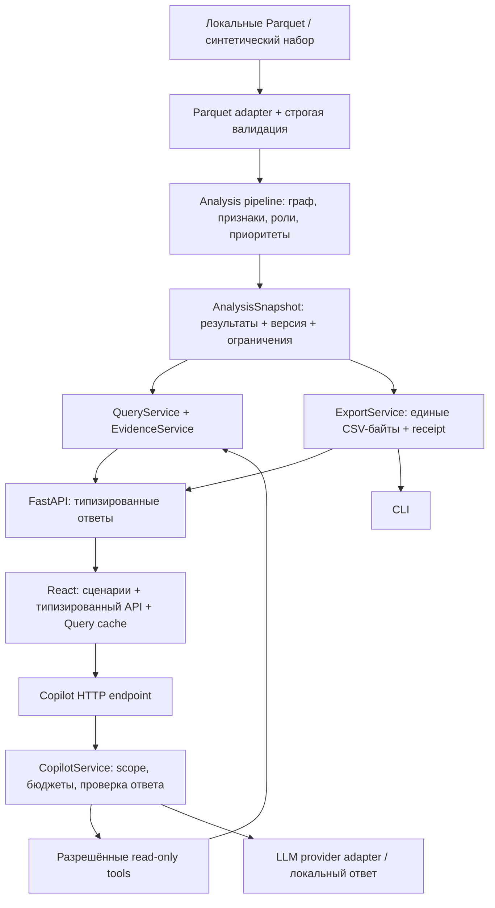

# EvidenceGraph: проект полной архитектурной переработки

Дата: 23 сентября 2026. Аудит: `28f5047`. Основа реализации после повторного pull: `9ff50b9` (`origin/codex/freedom-moneygraph`), с обновлённым интерфейсом и пагинацией.

Статус: реализовано; актуальные изменения интеграции описаны ниже.

## Integration update — 23 September 2026

Реализация завершена поверх `c2eb471`. По прямому указанию пользователя продолжение и повторная проверка выполнены без субагентов. Сохранены пришедшие через git pull интерфейс Aqsha Lens на React Flow/Dagre, восемь инструментов, локальные HTTP-ограничения и опциональная память диалога. Более строгий upstream-лимит 45 секунд заменил первоначальные 60. Ниже сохранён согласованный исходный дизайн и результаты первичного аудита; актуальное состояние описывают [архитектура](../../architecture.md) и [проверки](../../architecture-verification.md).

## 1. Цель и границы

Сделать существующий EvidenceGraph понятным для командной разработки, согласовать backend и frontend, устранить скрытые зависимости и сохранить воспроизводимость анализа. Переработка охватывает весь текущий путь: Parquet → проверки → графовые признаки → роли/приоритеты → сигналы → API/CLI → интерфейс и ограниченный AI-помощник.

Основание — присланное ТЗ Freedom Finance и `AGENTS.md`. Вход: 2 248 узлов, 3 119 рёбер и 4 840 транзакций; разовая выгрузка; локальный обычный ноутбук; полный расчёт и три CSV не дольше пяти минут. Меток истинных ролей нет. Расширение до миллиона узлов требуется описать, а не реализовать на хакатоне.

Обязательные свойства целевой системы:

- Каждый входной узел присутствует в результате, включая изолированные seed.
- Формулы, пороги, порядок разрешения равных оценок и состав CSV сохраняются при архитектурной миграции. Изменение методологии оформляется отдельной задачей.
- Граница четвёртого колена, неполные входящие seed и точность дат остаются явными ограничениями выводов.
- CLI, HTTP, досье и AI используют одну версию рассчитанных данных.
- Основной сценарий работает без API-ключей и сетевых запросов после установки зависимостей.
- AI не меняет роли, приоритеты и обязательные выгрузки.
- Генерируемые данные, заметки и ключи остаются вне Git.

Авторизация нескольких пользователей, онлайн-поток транзакций, внешнее обогащение и обучение моделей не входят в эту переработку. Сохранение расследований предусмотрено как отдельное последующее расширение, чтобы архитектурная миграция имела проверяемый объём.

## 2. Что подтвердил аудит

| Наблюдение в текущем коде | Последствие | Целевое изменение |
|---|---|---|
| `engine.py:98` — `Analysis` валидирует вход, строит граф, считает признаки/правила, обслуживает выборки и пишет файлы | Разные причины изменений затрагивают один класс | Разделить загрузку, вычислительный конвейер, чтение результатов и экспорт |
| `api.py:20–28` — загрузка окружения и глобальный ленивый `_analysis` | Скрытый жизненный цикл, потенциальное совместное состояние нескольких приложений в одном процессе | Явная конфигурация и один контекст на экземпляр приложения |
| `api.py:58` кеширует `SignalAnalysis`, а `copilot.py:118` создаёт его заново | Разные пути получения одинаковых доказательств, повторное построение индексов | Общий `EvidenceService` и кеш в контексте анализа |
| `signals.py` и `audit.py` читают `_records`, `_transactions`, `_daily`, `_ranked` | Внутреннее представление движка становится фактическим публичным API | Публичная модель результатов и небольшие интерфейсы чтения |
| HTTP-ответы в `api.py` не имеют моделей результата | OpenAPI не описывает важнейшие ответы; ошибки формы обнаруживаются поздно | Pydantic-модели на границе HTTP и генерация TypeScript |
| `web/src/api.ts:17` объявляет `pass_through: number`, хотя движок возвращает `None` | Статическая типизация не отражает реальность | Одна схема контракта с явной nullable-семантикой |
| `copilot.py` содержит HTTP-router, выбор инструментов, SDK-вызовы, лимиты и проверку ответа | Сложно отдельно проверять политику инструментов и менять провайдера | Разделить HTTP, сценарий помощника, реестр инструментов и адаптер провайдера |
| CSV сериализуется в `engine.py`, `api.py` и `audit.py` | Три места должны синхронно сохранять порядок колонок, кодировку и переводы строк | Один сериализатор байтов для CLI, HTTP и receipt |
| Receipt хеширует только `engine.py` | После разбиения модулей отпечаток перестанет охватывать весь расчёт | Версионируемый manifest вычислительных модулей, настроек и зависимостей |
| В `App.tsx` и `SignalPanels.tsx` повторяется ручное управление запросами | Состояние экрана, загрузка и рендеринг связаны между собой | Компоненты по сценариям и единый слой серверного состояния |

Проверено исполняемым кодом: у `/api/summary`, `/api/graph` и `/api/nodes/{gid}` схема успешного JSON-ответа в OpenAPI равна `{}`. В оригинальном синтетическом наборе у 21 узла `metrics.pass_through` равен `null`.

Локальная исходная проверка на Windows/Python 3.12.14: **35 тестов прошли**, `tsc -b` и Vite production build прошли. У pytest есть предупреждение об устаревающем транспорте Starlette/httpx. Повторный запуск использовал временную папку внутри проекта из-за ограничений песочницы. Датасет организаторов в этой сессии не запускался; опубликованные в `docs/validation.md` прежние замеры не являются новым измерением на этом компьютере.

## 3. Внешние реализации и применимые решения

| Проект | Что действительно описано или реализовано | Что переносим в наш дизайн |
|---|---|---|
| [MongoDB ThreatSight 360](https://github.com/mongodb-industry-solutions/fsi-aml-fraud-detection/blob/main/docs/SOLUTION_ARCHITECTURE.md) | Next.js, два FastAPI backend, MongoDB Atlas, Bedrock, LangGraph. В [исходнике workflow](https://github.com/mongodb-industry-solutions/fsi-aml-fraud-detection/blob/main/aml-backend/services/agents/graph.py) есть состояния расследования, параллельные вычисления, checkpoints и пауза перед human review | Разделение сбора фактов, вычислений, текста, валидации и решения аналитика. Сеть и временные признаки в этом workflow считаются обычным кодом |
| [GraphSense](https://graphsense.org/documentation.html) | Python toolkit для ingestion/transformation, FastAPI REST API, Cassandra и Elm dashboard. В [репозитории прежней сборки](https://github.com/graphsense/graphsense-setup) явно разделены исходные данные, преобразование и представления для чтения | Предрасчёт результатов отдельно от интерактивных запросов; API и UI работают с одной версией аналитического результата. Старую схему Spark/Flask не выдаём за текущий стек |
| [FalkorDB RedThread](https://github.com/FalkorDB/RedThread#architecture) | FastAPI → прикладные сервисы → слой запросов графа → FalkorDB; отдельная SQLite для расследований; snapshots/diff и опциональный LLM | Сервисные границы и отделение записей аналитика от вычисляемого графа. Это публичный reference-проект, а не подтверждение промышленного использования конкретным банком |
| [IBM AMLSim](https://github.com/IBM/AMLSim) | Python-генератор графа и Java-симулятор транзакций с заданными паттернами | Отдельный набор синтетических сценариев для проверки алгоритмов, без объявления их доказательством точности на банковских данных |

Это адаптация архитектурных подходов. Облачные зависимости ThreatSight, кластер Cassandra GraphSense и графовая БД RedThread не нужны для текущего размера и режима данных. Внешние watchlist, KYC и атрибуция из этих проектов также не входят в разрешённые данные кейса.

### Выбранный вариант

**Модульный монолит с предрасчётом и интерфейсами чтения.** Один Python backend, один собранный frontend, общие прикладные сервисы для CLI и HTTP. Каждый модуль имеет конкретную ответственность. NetworkX и Polars остаются вычислительными инструментами.

Рассмотренные альтернативы:

1. Графовая БД и отдельный слой запросов, как в RedThread: оправдана при постоянных обновлениях графа и многочисленных произвольных запросах. Сейчас добавляет обязательный сервис без закрытия нового требования.
2. Несколько сервисов и долговечный agent workflow, как в ThreatSight: полезны для расследований, продолжающихся после перезапуска и ожидающих решения человека. Для текущего ограниченного помощника стоимость эксплуатации и миграции выше пользы.

Новые процессы вводятся по измеренной нагрузке или требованию к независимому жизненному циклу. Отдельный модуль сам по себе не требует отдельного сервера.

## 4. Целевая схема



Стрелки показывают поток данных. Зависимости кода направлены от HTTP/CLI и адаптеров к прикладным сценариям и вычислительному ядру. Ядро не импортирует FastAPI, OpenAI SDK, переменные окружения или frontend.

## 5. Backend: владельцы ответственности

Предлагаемая структура, окончательные небольшие файлы можно объединять внутри пакета без нарушения границ:

```text
src/moneygraph/
  bootstrap.py                 # сборка зависимостей и lifecycle
  settings.py                  # валидируемые настройки запуска
  __main__.py                  # тонкий CLI
  domain/
    models.py                  # узлы, метрики, результаты, ограничения
    rules.py                   # правила ролей и приоритета, их версия
  analysis/
    validation.py              # проверки схем и агрегатов
    pipeline.py                # порядок вычислений
    graph.py                   # построение графа, communities, centrality
    features.py                # направленные и временные признаки
    signals.py                 # маршруты, циклы, аномалии, resilience
    snapshot.py                # законченный результат одного расчёта
  application/
    context.py                 # один snapshot и его индексы/кеши
    queries.py                 # summary, nodes, graph, clusters
    evidence.py                # доказательства, досье, ограничения
    exports.py                 # точные CSV-байты
    provenance.py              # fingerprint и manifest
    errors.py                  # ошибки предметных сценариев
  copilot/
    service.py                 # ограниченный цикл получения ответа
    tools.py                   # реестр фиксированных инструментов
    policy.py                  # scope, лимиты, допустимые действия
    validation.py              # проверка результата и ссылок
  adapters/
    parquet.py                 # чтение локальных файлов
    filesystem.py              # запись готовых экспортов
    openai_provider.py         # конкретный SDK и преобразование событий
  api/
    app.py                     # FastAPI factory, headers, static assets
    dependencies.py            # доступ к app-owned контексту
    schemas.py                 # HTTP request/response модели
    analysis_routes.py
    investigation_routes.py
    export_routes.py
```

Не вводим общий `BaseRepository`, контейнер dependency injection или абстракцию над каждым алгоритмом. Интерфейсы нужны на настоящих внешних границах: загрузка данных, LLM и запись артефактов. Существующие импорты `moneygraph.engine`, `moneygraph.api` и `moneygraph.copilot` при необходимости временно сохраняются через совместимые фасады без второго экземпляра бизнес-логики.

### AnalysisSnapshot и жизненный цикл

`build_analysis(validated_input, rule_config)` заканчивается созданием результата со следующими данными: канонический набор узлов/переводов, признаки, роли, порядок приоритетов, communities, индексы дат и ограничений, `analysis_id`.

Построение может изменять внутренние структуры. После публикации snapshot принадлежит только контексту; API и AI не получают изменяемых ссылок на граф, кеш или вложенные словари. Внешние ответы создаются как самостоятельные DTO. Обычный `frozen=True` или заморозка структуры NetworkX не считаются защитой всех вложенных атрибутов: это отдельно проверяется тестом.

`create_app(settings, context_factory)` создаёт изолированный экземпляр приложения. FastAPI lifespan один раз загружает данные, строит snapshot, создаёт общий `SignalAnalysis` и прикладные сервисы. При остановке закрывает принадлежащие приложению ресурсы. Нет глобального fallback, который может вернуть данные другого app instance. CLI использует тот же builder и сервис экспорта без HTTP.

Для текущего батча замену файлов применяем после явного перезапуска. Во время работающего процесса snapshot не изменяется. Режим reload или очередь вычислительных задач вводятся позже только при появлении соответствующего сценария.

### EvidenceService

HTTP и AI читают одно вычисленное доказательство. Сервис предоставляет конкретные операции: выбранный узел, ограниченная окрестность, community, сигналы, общие downstream-узлы, моделирование удаления и досье.

Предлагаемая внутренняя форма `EvidenceItem`: `evidence_id`, `analysis_id`, `kind`, `subject_gids`, вычисленные значения с единицами, ограничения наблюдения и поиска. Гипотезы и запросы недостающих данных отделены от наблюдаемых значений. Ссылки в ответе принадлежат одному `analysis_id`.

Общий контекст хранит индексы сигналов и ограниченный кеш. Ключ включает `analysis_id`, операцию и нормализованные параметры. Повторный вызов из AI использует тот же путь, что и экран. Для дорогих одинаковых одновременных запросов вычисление выполняется один раз. Кеш не отдаёт изменяемый объект наружу.

Окрестность для визуальной навигации может учитывать соседство в обоих направлениях, сохраняя направления рёбер. Поиск downstream-путей и общих получателей всегда следует направлениям переводов. Эти операции имеют разные имена и тесты, чтобы их невозможно было случайно подменить.

Для браузерного подграфа задаём явные ограничения числа узлов и рёбер: максимум 400 узлов и 2 000 рёбер на ответ. Отсечение детерминированно и раскрыто в метаданных. Для AI сохраняются пределы 35 узлов и 60 рёбер. Неполная выборка никогда не представляется полной сетью.

### Экспорты и воспроизводимость

`ExportService.render(name) -> bytes` — единственная реализация сериализации трёх обязательных CSV. CLI пишет эти байты, HTTP возвращает их, provenance хеширует их же. Порядок колонок, строк, JSON в `top_gids`, кодировка UTF-8 и окончания строк фиксируются совместимыми тестами.

Новая версия receipt содержит канонический dataset hash, версию правил, hash конфигурации, hash manifest вычислительных исходников и lock-файла, hashes CSV. Список исходников в manifest явный и проверяется при изменении вычислительного пакета. Для сопоставимости checkout на Windows/Linux исходный текст канонизируется в UTF-8 с LF. Пути пользователя, случайные временные имена и время запуска не входят в `analysis_id`.

В версии 2 receipt меняется честно: старый `algorithm_sha256` больше не называется полным отпечатком системы. Совместимость CSV проверяется отдельно от неизбежно нового отпечатка исходников после рефакторинга.

## 6. Контракт API и интерфейс

Для каждой успешной JSON-операции задаётся конкретная response-модель. `pass_through`, пустой период и отсутствующий выбранный узел описываются nullable-типами. Роли — ограниченный словарь, расширяемый версией схемы. Ошибки валидации, неизвестный узел и недоступность provider имеют стабильные коды и безопасное сообщение.

Цепочка контракта: **Pydantic → OpenAPI JSON → сгенерированные TypeScript-типы → типизированный клиент**. OpenAPI экспортируется без запуска анализа и без подключения LLM. CI проверяет, что сгенерированные файлы соответствуют схеме. Для генерации подходит [openapi-typescript](https://openapi-ts.dev/introduction); runtime-проверки на сервере обеспечиваются response-моделями [FastAPI](https://fastapi.tiangolo.com/tutorial/response-model/).

Идентификатор `gid` имеет смысл непрозрачного ID. Python и CSV сохраняют точное целое int64. В целевом JSON-контракте ID передаются десятичными строками, чтобы браузер не терял точность после 2^53−1. Для этого вводится `/api/v1`; существующие `/api` сохраняются как временный адаптер до переноса текущего UI и тестов. Миграция всех ID включает узлы, `src/dst`, пути, cohort, root и citations. Произвольное преобразование ID в `Number` исключается. В CSV никаких новых строковых кавычек или изменений обязательных колонок не появляется.

Предлагаемая организация frontend:

```text
web/src/
  app/                         # провайдеры, компоновка, выбор текущего анализа
  features/
    investigation/             # очередь и выбранный счёт
    graph/                     # Cytoscape и управление графом
    evidence/                  # метрики и временная диаграмма
    communities/
    signals/
    resilience/
    copilot/
  shared/
    api/                       # generated schema + клиент
    ui/                        # загрузка, ошибка, пустое состояние
    format/                    # деньги, даты, роли
```

Для серверного состояния используем [TanStack Query](https://tanstack.com/query/latest/docs/framework/react/overview): ключи включают `analysis_id`, `gid` и фильтры; одинаковые запросы разделяют кеш. Выбор вкладки, узла и cohort остаётся обычным состоянием React. Отмена запросов при смене выбора сохраняется. Старый ответ не должен появляться в карточке нового узла.

Для immutable snapshot фоновые обновления по фокусу отключены; ошибки чтения имеют явную кнопку повтора. Вызов AI — mutation без автоматического retry, чтобы сетевой сбой не порождал скрытые платные повторные обращения. Кеш существует только в памяти браузера. Смена `analysis_id` очищает данные предыдущего анализа и повторно валидирует выбор.

Сохраняются текущая визуальная тема, основные экраны, ленивое подключение Cytoscape и доступ к узлам через очередь с клавиатуры. Это изменение организации кода и управления состоянием; редизайн не нужен для проверки архитектуры.

## 7. AI как ограниченный потребитель доказательств

Публичный handler только валидирует запрос и вызывает `CopilotService`. Сервис получает доверенный `InvestigationScope` из приложения: текущий анализ, выбранный узел, до пяти явно выбранных существующих счетов. Модель не расширяет scope.

Сохраняются семь инструментов с пустыми аргументами, три model rounds, четыре tool calls, максимум 2 000 output tokens на вызов и две параллельные сессии на приложение. Добавляется общий deadline 60 секунд; timeout очередного provider-вызова не больше оставшегося времени и текущих 20 секунд. Автоматические SDK retries остаются выключены. Все выхода освобождают ресурсы и лимит параллельности.

Provider adapter отвечает за SDK, перевод tool calls и ответов в внутренние типы. Политика доступа, ограничения и проверка citations живут вне SDK и доступны для offline-тестов. Для объяснения всегда доступен текущий локальный fallback; в интерфейсе виден фактический режим ответа.

Проверка результата требует известных evidence IDs текущего запроса, допустимой структуры, длины и сохранения обязательных ограничений наблюдения. Числа в структурированных фактах сопоставляются с evidence по значению и единице. Такая проверка не объявляется доказательством истинности произвольного текста: числовое согласование и корректность объяснения измеряются раздельно.

Долговечный workflow `scope → facts → hypothesis → validation → analyst review` — следующий уровень при появлении сохранённых расследований. Для checkpoint/resume подходит [LangGraph persistence](https://docs.langchain.com/oss/python/langgraph/persistence), как в ThreatSight. Сейчас ограниченный цикл остаётся небольшим обычным сервисом. Подключение framework без требования к resume не является целью рефакторинга.

## 8. Запуск, наблюдаемость и последующее расширение

Настройки читаются и валидируются в composition root, после чего передаются явно. Импорт аналитических модулей не читает `.env`, файлы данных или сеть. Backend остаётся на loopback; текущие Host/CORS/response-header ограничения сохраняются.

Метрики исполнения: время загрузки/валидации/признаков/сигналов, cache hits, длительность AI и причина fallback. В обычные логи не попадают gid, cohort, тексты запросов, строки транзакций или ключи. Трасса инструментов для аналитика — структурированные события без скрытых рассуждений модели.

Команды запуска и проверок получают общий Python launcher и оболочки для PowerShell/bash. Установка идёт по lock-файлам. Сборка статических файлов и расположение `web/dist` проверяются для документированного способа установки; старт не полагается на случайный рабочий каталог. CI проверяет Windows и Linux, тесты backend, актуальность OpenAPI/TS и frontend build. Сетевой smoke с LLM остаётся отдельным явным запуском.

Сохранённые расследования впоследствии используют отдельный `CaseService` и локальную SQLite: выбранные ID, заметки, статус, `analysis_id`, история решений. Вычисленные финансовые роли не перезаписываются заметками. Это соответствует разделению графа и кейсов в RedThread; локальная SQLite подходит по [описанию применимости SQLite](https://www.sqlite.org/whentouse.html).

При росте к миллиону узлов сначала измеряются загрузка, память и дорогие алгоритмы. Затем: partitioned Parquet, материализованные признаки/ранжирование, отдельная пакетная задача вычислений, индексы ограниченных подграфов, приближённая centrality с оценкой отклонения. Новый backend графовых операций выбирается по benchmark на тех же контрактах. Графовая БД, очередь и GPU появляются только после измеренного обоснования. Интерфейс продолжает получать ограниченные ответы.

## 9. Порядок миграции

Каждый этап сохраняет работающее приложение и отдельный проверяемый результат. Это последовательность архитектурных изменений; подробные задачи реализации составляются после согласования схемы.

1. **Зафиксировать поведение.** Синтетические golden exports, снимок текущего OpenAPI, offline-сценарии и baseline времени. Артефакты содержат только созданные нами синтетические данные.
2. **Ввести context и общие сервисы.** Устранить глобальный `_analysis`, единообразно внедрять анализ в HTTP/CLI/AI; разделить провайдер и маршруты помощника; использовать общий сервис сигналов. Проверить изоляцию двух app instances.
3. **Разделить вычислительное ядро.** Выделить validation, graph/features и rules, затем read-модель. Убрать доступ потребителей к приватным полям. Сверить все CSV и обязательные объяснения с baseline.
4. **Объединить экспорт и provenance.** Один сериализатор, receipt v2, manifest. Сопоставить скачанные и записанные байты, проверить независимость от порядка входа.
5. **Ввести типизированный `/api/v1`.** Полные JSON-модели, строковые ID, генерация OpenAPI/TS, единые ошибки и метаданные усечения. Старые `/api`-операции временно делегируют тем же сервисам.
6. **Перенести frontend по сценариям.** Typed client, Query cache, малые панели, единый выбор текущего анализа. После проверки всех экранов удалить старые ручные типы и остановить использование legacy API интерфейсом.
7. **Закрыть проверку миграции.** Cross-platform запуск, CI, offline-оценка помощника, browser smoke и актуальные README/architecture/validation. Legacy API удаляется отдельным явным изменением только после проверки отсутствия нужных потребителей.

## 10. Приёмка архитектуры

- Все существующие 35 тестов сохраняют проверяемое поведение; адаптация импортов не удаляет их проверки. Полная сборка frontend проходит.
- Три CSV до и после переноса побайтово совпадают на зафиксированных синтетических сценариях. Новая версия receipt явно отличается только своей схемой/описанием вычислений, а не скрыто выдаётся за старую.
- CLI и HTTP используют одинаковые байты экспорта; receipt содержит фактические SHA-256 этих байтов.
- Создание двух приложений с разными анализами в одном процессе не смешивает данные, кеши и AI scopes.
- Изменение полученного DTO или результат resilience не меняет исходный snapshot и обязательные CSV.
- В новых OpenAPI-ответах нет пустой `{}` вместо предметной схемы; generated TypeScript проверяется в CI. Nullable-значения и int64 ID проходят round trip без потери информации.
- Для HTTP и AI одинаковые запросы evidence имеют одинаковый fingerprint и исходные значения; разные лимиты представления раскрыты явно.
- Смена выбранного счёта во время загрузки не показывает устаревший ответ; перезапуск с другим анализом очищает старый кеш.
- Проверены неизвестный узел, изолированный seed, граница глубины, несовпадение агрегатов, отказ provider, неверная citation, превышение бюджета и попытка расширить scope.
- Offline browser smoke: очередь → поиск gid → направленный граф → сигналы → cohort → resilience → локальный copilot → три выгрузки.
- Замер на официальных файлах выполняется локально при наличии этих файлов и отдельно подтверждает предел пяти минут. До этого в отчёте указывается только синтетическая проверка.

## 11. Решения, требующие согласования перед кодом

Предлагается согласовать единый пакет: модульный монолит; сохранение методологии и CSV; общий snapshot/evidence service; typed API с постепенной миграцией ID; разделение AI; frontend по сценариям; cross-platform проверки. Сохранённые расследования и долговечные agent workflows остаются следующим продуктовым этапом.

После согласования этот документ становится основанием для плана реализации и последовательного рефакторинга. Сам по себе документ не означает, что целевая архитектура уже реализована или измерена.
